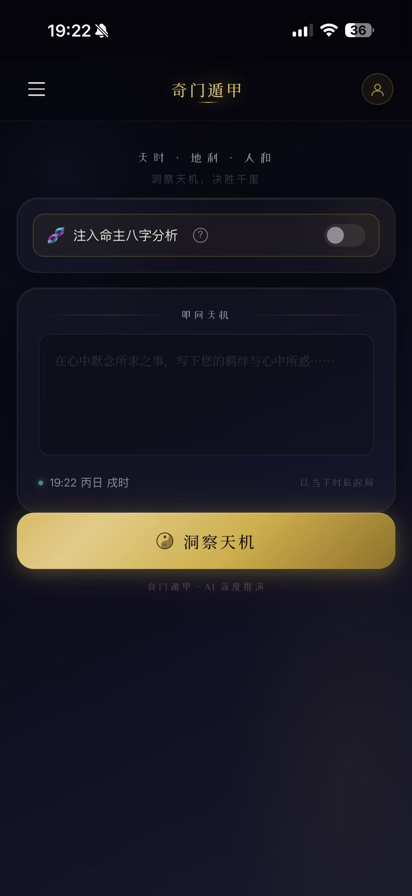
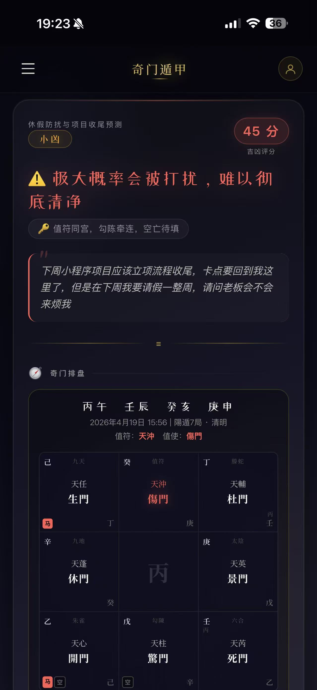
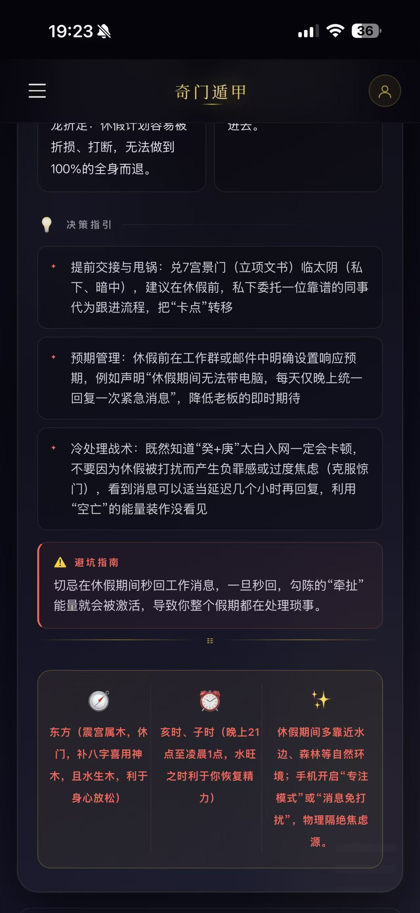

# 奇门遁甲 · AI 决策引擎

> **将三千年玄学智慧，接入现代 AI 推理引擎。**  
> 时家奇门拆补转盘法 × Gemini 大模型 × 全栈 Web 应用

<p align="center">
  
  &nbsp;&nbsp;
  
  &nbsp;&nbsp;
  
</p>

<p align="center">
  
  
  
  
</p>

---

## 为什么这个项目与众不同

坊间的奇门工具要么只会排盘，要么只会复读术语。

这个项目做了一件不同的事：**让 AI 真正读懂盘面，而不是背诵口诀。**

系统在每次推演前，先用轻量路由模型识别问题意图（求财 / 事业 / 感情 / 健康 / 交易 / 杂事），再将对应领域的专属取用神规则动态注入主推演 Prompt——生门管财、六合论情、伤门辨病，用神锁定精准，得出的结论才有落地价值。

这不是套模板，是结构化推理。

---

## 核心能力

### 专业排盘引擎
- **时家奇门拆补转盘法**，精确实现甲子隐遁、符头定位、九星八门八神飞布
- 自动处理寄宫逻辑（天芮/天禽中宫寄坤）
- 日空 / 时空 / 驿马星实时计算，同步渲染至九宫盘面

### 双层 AI 推演架构
```
用户提问
  └─► 意图路由器 (Gemini Flash · 极低延迟)
        └─► 分类：career / finance / relationship / health / transaction / general
              └─► 专属用神规则动态注入
                    └─► 主推演引擎 (Gemini Pro · 深度推理)
                          └─► 结构化 JSON 决策卡片
```

### 六大问题域精准解读

| 类型 | 核心用神 | 专项逻辑 |
|------|----------|----------|
| 💼 事业职场 | 值使门 · 开门 · 天辅星 | 竞争压力 · 贵人方位 · 谈判节点 |
| 💰 求财投资 | 生门 · 戊干 · 驿马 | 财路方位 · 到账应期 · 破财风险 |
| ❤️ 感情婚恋 | 应宫 · 六合 · 丙庚 | 对方心意 · 感情阻力 · 破冰时机 |
| 🏥 健康竞技 | 天芮星 · 伤门 · 白虎 | 测病 vs 竞技极性辨别 · 风险部位 |
| 📦 交易合同 | 景门 · 日时干 · 生死门 | 真伪验证 · 买卖主导权 · 盈亏判断 |
| 📋 日常杂事 | 值使门 · 驿马 | 动静判断 · 当日最优时间窗口 |

### 动态破局推演
不会停留在静态凶象。盘面有杜门堵塞、空亡虚耗？系统强制向后推演十二时辰，找出：
- 何时辰五行克制忌神
- 何时辰驿马被冲动引发变化  
- 何时辰空亡宫位被填实

结论中会明确标注转机节点，而不是给你一个模糊的"近期不利"。

### 八字命理融合
可选注入命主八字信息。系统自动提取年命天干落宫，结合日干进行旺衰双重验证。两套体系交叉印证，应期判断更精准。

---

## 技术栈

```
前端          Vanilla JS · CSS 变量 · Canvas 星空背景
后端          Vercel Serverless Functions (Node.js)
数据库        Supabase (用户认证 · 历史记录 · 八字档案)
AI 模型       Gemini 1.5 Flash (意图路由) + Gemini Pro (主推演)
历法计算      lunar-javascript (干支 · 节气 · 八字)
```

### 关键工程细节

**云端内存缓存**：相同时辰 + 相同问题命中缓存直接返回，节省 Token 开销，降低延迟。

**八字断语缓存**：命主断语首次生成后写入 Supabase，后续调用零 API 消耗，支持手动清除重推。

**60 秒超时熔断**：主推演设置 AbortController，防止云函数长时间挂起；前端 90 秒超时独立计时，双重保障。

**四柱反推**：支持直接输入干支四柱，系统自动反推对应阳历日期，并遵循五虎遁 / 五鼠遁自动锁定月干与时干。

---

## 快速部署

### 前置条件
- [Vercel](https://vercel.com) 账号
- [Supabase](https://supabase.com) 项目（需建表，见下方）
- Gemini API Key（[Google AI Studio](https://aistudio.google.com) 免费申请）

### 数据库建表

在 Supabase SQL Editor 执行：

```sql
-- 推演历史记录
create table qimen_records (
  id uuid default gen_random_uuid() primary key,
  user_id uuid references auth.users not null,
  question text not null,
  qimen_data jsonb,
  category varchar(30) default 'general',
  created_at timestamptz default now()
);

-- 命主八字档案
create table bazi_profiles (
  id uuid default gen_random_uuid() primary key,
  user_id uuid references auth.users not null,
  name text not null,
  gender char(1) check (gender in ('M', 'F')),
  birth_date text,
  bazi_str text,
  bazi_summary text,
  created_at timestamptz default now()
);

-- 开启行级安全
alter table qimen_records enable row level security;
alter table bazi_profiles enable row level security;

create policy "用户只能访问自己的数据" on qimen_records
  for all using (auth.uid() = user_id);

create policy "用户只能访问自己的档案" on bazi_profiles
  for all using (auth.uid() = user_id);
```

### 部署步骤

```bash
# 1. Fork 本仓库并克隆
git clone https://github.com/your-username/qimen-ai.git
cd qimen-ai

# 2. 部署到 Vercel
vercel deploy

# 3. 在 Vercel Dashboard 设置环境变量
GEMINI_API_KEY=your_api_key_here
```

在 `index.html` 顶部填入你的 Supabase 项目 URL 和 Anon Key，完成。

---

## 项目结构

```
/
├── api/
│   ├── qimen.js          # 主推演接口：排盘 · 意图路由 · AI 推演 · 结果组装
│   └── bazi.js           # 八字断语接口：子平分析 · 云端缓存
├── lib/
│   ├── QimenCalculations.js   # 核心算法：天地盘飞布 · 九星八门八神
│   ├── QimenConstants.js      # 静态数据：节气局数 · 洛书轨迹 · 地盘配置
│   └── QimenUtils.js          # 工具函数：旬首查询 · 干支提取 · 数组旋转
├── index.html            # 前端单页应用
└── package.json
```

---

## 效果展示

<p align="center">
  
  &nbsp;
  
</p>

**结果卡片包含：**
- 吉凶评分（0–100，自动变换主题色）与五段式断语（大吉 / 小吉 / 平 / 小凶 / 大凶）
- 评分依据：吉象支撑标签 + 风险信号标签 + 权重逻辑说明
- 九宫排盘可视化（值符 / 值使高亮，空亡 / 马星标注）
- 动态应期推演（精确到时辰的破局节点）
- 有利方位 / 有利时间 / 助运行为三项锦囊

**历史记录抽屉：**
- 按问题类型筛选（六分类胶囊切换）
- 条目展示时间 · 分类标签 · 吉凶评分三维 meta 信息

---

## 设计理念

这个项目拒绝"结果永远向好"的讨好式输出。

Prompt 中有明确的反向约束：**禁止因问题积极就盲目倾向高分**。凶象如实呈现，吉象才有说服力。建议基于盘面推演，不基于用户情绪。

同时它也不是冷冰冰的数据机器。感情类问题有专属的情绪基调指令，分析先共情再推演；健康类问题区分测病与竞技的判断极性——同一个"伤门乘白虎"，在求医问诊里是警示，在格斗比赛前是吉兆。

语境决定象意，这是奇门解卦的精髓，也是这套系统努力实现的目标。

---

## 鸣谢

- [lunar-javascript](https://github.com/6tail/lunar-javascript) — 干支历法底层计算
- [Google Gemini](https://deepmind.google/technologies/gemini/) — AI 推演引擎
- [Supabase](https://supabase.com) — 开源数据库与认证服务

---

## 开源协议

MIT License · 可自由使用、修改与分发，保留原作者声明即可。

> 玄学推演结果仅供参考，请理性决策。  
> 天机可以问，终究要自渡。
