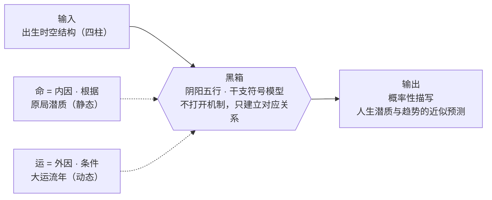
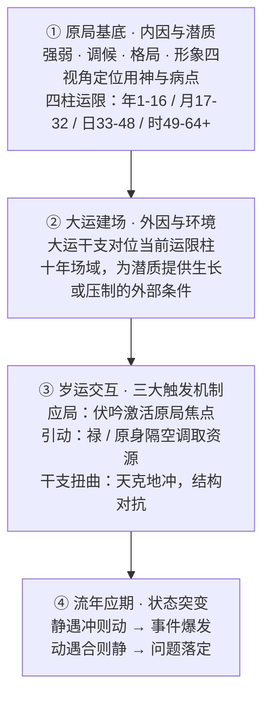

# 奇门遁甲 · AI 决策引擎

> **把一套关于结构与变化的古典认知体系，接入现代 AI 推理引擎。**  
> 时空局势建模 × 个体禀赋结构分析 × 古籍命例校验 × 双轴语义路由 × 可审计推演过程 × Gemini 大模型 × Vue 全栈应用

> *"穷则变，变则通，通则久。"* —— 结构终将变化，而变化本身可以被认知、被建模。这是整个项目的方法论起点，也是它与"算命"的分界线。

<p align="center">
  
  &nbsp;&nbsp;
  
  &nbsp;&nbsp;
  
</p>

<p align="center">
  
  
  
  
  
</p>

<p align="center">
  简体中文 |
  <a href="./docs/readme/README.en.md">English</a> |
  <a href="./docs/readme/README.zh-TW.md">繁體中文</a>
</p>

---

## 项目简介

多数命理工具要么只会排盘，要么只会用玄妙辞藻反复套模板。这个项目想做的是另一件事：**把中国古典决策哲学里"情境—时间—行动"这套结构化认知框架，用确定性规则引擎实现出来，再让 AI 负责表达，而不是让大模型凭空生成玄学话术。**

拆开来看，奇门遁甲的九宫飞布，本质上是一套关于"局势结构如何随时间演化"的时空模型；八字的干支系统，本质上是一套关于"个体禀赋与所处阶段如何相互作用"的结构模型。二者共享同一套底层世界观——阴阳消长、五行生克——这是一套朴素的关系本体论：万物不是孤立的实体，而是彼此制约、此消彼长的关系网络。这个思路比控制论、系统动力学早了两千多年，用符号语言描述变量之间生克制化的动态平衡，某种意义上更接近怀特海的"过程哲学"——事物不是"是什么"，而是"正在如何变化"。

用户提问后，系统会先判断这道题该用哪套框架回答：局势模型（奇门）、禀赋结构模型（八字），或两者联合推演。分流模块先识别问题类型，再把对应的结构规则、命盘上下文与现实语境交给推演引擎处理。

局势模型负责具体事件、短期决策、时机窗口；禀赋结构模型负责个体结构、阶段趋势、长期适配；节奏评分模块负责日、周、月、年的状态量化与可执行建议。客观计算由本地规则引擎完成，大模型只负责把结构化结论转译成可读、可行动的语言——它不做判断，只做翻译。

这不是给算命应用换一层皮，是一套**先做结构化认知，再用语言表达，而不是用语言制造神秘感**的推演系统。

---

## 推演背后的认识论

在动手做技术设计之前，先要回答一个更根本的问题：**这套系统到底在断言什么？** 这个立场不是本项目自己发明的包装话术，而是陆致极在《命运的求索》《八字命理动态分析教程》里给出的、体系内部最接近现代科学方法论的自我定位：

> "命是根据，运是环境；命是内因，运是条件。命理学就是探讨'命'和'运'的相互作用，来揭示和展现一个人丰富多彩的人生起伏轨迹。"

> "作为这个黑箱的输入，是一个人的出生时辰。作为黑箱的输出，是关于这个人的生命潜质和人生历程的描写和预测。"——他将命理学的根本局限首先归结为**"概率性描写"**：这是一种基于经验观察的近似预测，而非神学式的绝对因果决定。

他借用控制论的"黑箱"概念自我定位：不宣称打开黑箱、理解命运的终极机制，只观察输入（出生时空结构）与输出（人生潜质与趋势）之间"不是杂乱无章"的对应关系。



再往下一层，是他给出的可操作方法论——"动态分析"四个递进环节，讲清楚"潜质如何在时间中被激活为具体事件"：



原局是潜质（种子），大运是环境（场域），流年是触发（导火索）——三者共同决定"某个具体年份会不会爆发某件事"，而不是原局本身就写死了结局。这套四环节框架，正是本项目工程实现里「运限并轨」「应局」「禄 / 原身引动」几个概念的理论来源，也直接决定了下面所有工程决策：为什么算分要用规则引擎而不是提示词，为什么同一句话不同模型要给出一致结论，为什么低置信问题必须显式标注"不能强断"。

---

## 核心能力

*从这里开始是工程实现——把上面的认识论立场，落到具体的分流、规则与评分逻辑上。*

### 更新历史

**2026-07-09 · BaziEngine 1.8.28 · 原局准确度调优整合版**

把近期格局、旺衰、象法与喜忌调优收束为同一版原局决策说明。完整判断条件、执行顺序与 Mermaid 流程图见 [`docs/bazi-engine-architecture.md`](./docs/bazi-engine-architecture.md)。仍在 preview 阶段的专题派生能力不纳入本次版本。

- **原局决策链统一**：四柱进入引擎后并行识别格局、旺衰与象法，再汇入成格和喜忌链；`L0` 仅保留给会提前返回或覆盖普通链的特殊气势，其余节点按真实执行顺序描述。
- **格局与成格校准**：补入七杀有制、官杀去留、墓库杂气透干等主格候选；成格用神、相神和 protected / promoted / demoted / invalidated Effects 正式参与喜忌评分。
- **旺衰与象法校准**：旺衰统一为得令、得地、得助和结构修正的 10 分制；象法增加从格、专旺、化气、两气成象评分，并以有效根、反制力量和破象条件控制特殊覆盖。
- **喜忌执行顺序明确**：普通链按调候 → 病药 → 通关 → 扶抑 → 格局顺逆 → 成格取用 → 结构 Effects → 特殊救应 → 冲突消解执行；成格属于强先验，印星救主、羊刃驾杀属于窄条件最终纠偏。
- **经典命例回归**：24 个高置信命例严格加权准确率 `91.1%`，核心准确率 `95.7%`，用神 Top 1 `91.8%`，喜忌方向 `100%`，格局 `92.3%`，象法 `100%`，严重错误 `0`。该集合暂无旺衰真值，不将结果外推为旺衰准确率。

**2026-06-25 · 奇门 Skill 沉淀 + 盘面深度字段调优**

把奇门问事完整流程沉淀为可复用的 Agent Skill（见上「奇门遁甲 Agent Skill」），并补齐评分引擎此前缺失的盘面深度字段，让深度解读有数据可引、不靠模型臆造。引擎细节见 [`docs/qimen-scoring-engine-improvement.md`](./docs/qimen-scoring-engine-improvement.md)。

- **天地盘干生克（`stem_relation`）**：新增 `getStemRelation`，每宫天盘干与地盘干的生克方向（天生地 / 天克地 / 地生天 / 地克天 / 比和）写入 `timingPalaces` 与盘面 prompt，解读不再停留在「符号落在哪个宫」的表层。
- **格局落宫（`palace_index`）**：`detectNamedFormation` 由返回布尔改为返回落宫索引，有名格命中时记录落宫，解读带出「落某宫」并标注受影响角色，告别悬空的「格名 + 通用象义」。
- **旺衰修复（`prosperity`）**：新增 `qimenProsperity`，按月令补算九星旺相休囚死并接入 `evaluatePalace` 能量底板。此前生产环境从未喂入旺衰，「结构强度决定成败」的一票否决档位长期空转，本次修复后真正生效。
- **Skill 报告纪律**：起局时间改为「问事当下」口径（事件时间只作背景）；报告强制落盘并在开头渲染洛书九宫格；必须语义新增 `palace_depth_reading`，要求核心用神宫读到干生克、旺衰与门星神合力的第二层；写作加反填充约束（建议须绑定具体盘面信号、不靠重复结论充字数）。

**2026-06-13 · 问事追问（多轮深挖）**

奇门与八字问事都支持在原解读之上「追问深挖」，新增 `/api/qimen-followup` 与 `/api/bazi-followup` 两个流式接口。

- **一局一解，正本不动**：追问结果以增补子块挂在相关段落下，不覆盖原文、不重排盘、不重新打分——一个局的态势与分数在起局那一刻就固定，追问只换面向、做分层深挖。
- **深挖 / 新事小判断器**：先用轻量模型判断追问是「同一局深挖」还是「另起一事」；判为新事直接提示重新起局，不浪费大模型。
- **确定性补算**：追问若需要原盘没算的流年、大运、应期，由判断器按白名单点菜、后端确定性补算，大模型永远只读结果，不做 function calling。
- **反臆造延续**：补丁模型只能引用前端回传的盘面证据，不得引入新盘面元素，也不得泄漏内部量化指标；修正信息时以「原结论 →（因新情况）调整为…」对照呈现，绝不静默覆盖。

**2026-06-10 · 问事流式输出与自愈重试**

把问事从「一次性出整块 JSON」推进到「边算边出、出错能自愈、模型可按环境切换、文案不臆造也不漏指标」。

- 哨兵分段（`<<<SEC:...>>>`）协议把每个面向用户的散文段独立流式推送，规则引擎产物先上屏，AI 解读逐段补丁到对应卡片槽位。
- 结构校验硬失败（空流 / 核心段缺失 / `data_json` 不可解析）发 `llm_retry` 事件，前端清空半截内容回骨架，后端非流式重试一次；个别可选字段缺失走静默兜底。
- title 拆成独立流式段，点明问题类型与核心结论，不再混在结构化 JSON 里重复输出。
- 新增 `QUESTION_MODEL` 环境变量逐环境配置问事模型（代码默认回退 `gemini-3.1-pro-preview`，当前各环境切 `gemini-3-flash-preview` 验证）。
- 反臆造与化气格约束：只能引用后端实际盘面 / 四柱字段，严禁脑补不存在的门星神、宫位、生克刑冲合害；禁止「强度74.4」「能量值80」「置信度0.8」等内部数值进入用户文案，改用命理语言定性表达。

**2026-06-06 · 规则可评测、页面同源、历史可回放**

把八字问事从「模型会不会说得像」推进到「规则是否能被评测、页面是否同源展示、历史记录是否能安全回放」。

- 用神 / 目标十神评测纠偏：新增 [`docs/eval/yongshen-eval-2026-06.md`](./docs/eval/yongshen-eval-2026-06.md) 与 [`scripts/eval-yongshen.mjs`](./scripts/eval-yongshen.mjs)，用陆致极命例对照本地规则引擎，逐案标注吻合 / 部分 / 偏差，并记录从儿格、调候为急、印星救主、弃官就印等修复原因。
- 双轴语义路由：八字问事从 `status/timing/pattern/character` 单轴拆成 `framework`（推演框架）× `target_source`（目标来源）。
- 八字动态 panel 拾取逻辑：从 `state_report`、`dynamic_report`、`timing_candidates` 拾取目标十神、宫位与岁运引动，与规则引擎同源；低置信链路明确降级。
- 历史记录兼容：旧 `analysis_mode` 迁移到新双轴语义，存量问事记录继续回放。

**更早的功能演进**

- 运势页从单一日运扩展为日、周、月、年四层视图，可同时看今天、本周、本月和今年的节奏。
- 周运七日曲线、顺势日 / 谨慎日、周度标签与事业、财运、感情提醒。
- 月运分数曲线、高低分日、低谷期提示和综合 / 事业 / 财运 / 感情四类白话详批。
- 年运前后十年流年变化、大运背景、流年十神与岁运关系。
- 八字档案「断事笔记」记录事业、财务、感情、健康 / 生活状态，让月运解读更贴近现实处境。
- 奇门结果页保留应验反馈入口，方便回头标记推演准不准、实际走向如何。

### 自动术数分流引擎

这是系统的大脑。每次用户提问后，它会先判断问题属于具体事件、长期结构，还是需要奇门与八字联合推演——这一步本身就是认识论立场的落地：先分清"我在问什么类型的问题"，再决定用什么方法回答，而不是拿一套万能话术套所有问题。

- 通过本地规则和大模型意图判断，自动选择合适的推演框架
- 覆盖事业职场、求财投资、婚恋感情、健康疾病、交易失物、考试学习、官司法务、风水家宅、孕产子嗣等常见问题域
- 根据问题类型注入对应的取用神规则、命盘上下文和现实背景
- 信息不足时会先追问关键条件，不急着给出含混判断

### 奇门遁甲推演

- 实现时家奇门拆补转盘法，包含甲子隐遁、符头定位、九星、八门、八神飞布
- 自动处理天芮、天禽中宫寄坤、日空、时空、驿马星等盘面信息
- 按问题域动态切换取用神规则，避免同一套话术套所有问题
- 输出态势评分、风险信号、破局节点、有利方位、有利时间与行动建议
- 支持同一局追问深挖：不重排盘、不改分，把追问解读分层挂到相关段落下
- 支持历史记录回放和应验反馈，用于后续校准

### 奇门遁甲 Agent Skill（对话式推演技能）

把上面这套奇门事件链路沉淀成一个可被 AI Agent 直接调用的技能（[`docs/skills/qimen-dunjia/SKILL.md`](./docs/skills/qimen-dunjia/SKILL.md)），让"对话式排盘解盘"和网页端走同一套确定性规则底座，而不是让大模型凭空编玄学。

- **先访谈、后起局**：正式起局前先做结构化访谈，确认所问事项、起局时间、时区与判断目标，信息不全先追问，不急着断
- **固定流程不跳步**：结构化访谈 → 问题路由 → 固定起局 → `targetSpec` 取用 → 有界评分 → 应期扫描 → 唯一证据包 → 自由结构报告，全程不绕过引擎自由解盘
- **四条底线**：盘面事实必须来自脚本；低置信目标可由模型推导但须过白名单与盘面校验；模型目标只能有界参与评分（带权、有上限）；报告结构自由但关键语义（直接答案、取用逻辑、证据、风险、应期、建议、限制）不得遗漏
- **问事起局口径**：时家奇门以「问事当下」起局（北京时间、脚本解析时辰），用户提到的事件时间只作事项背景，不当起局时间
- **报告规范**：开头渲染洛书九宫格，命中有名格按落宫展开，逐宫读到旺衰与天地盘干生克，结尾附推演边界说明

### 全息八字系统

- 支持阳历、农历、四柱反查三种录入方式
- 支持出生地搜索、经度、平太阳时、真太阳时修正
- 展开四柱干支、十神、藏干、十二长生、纳音、旬空亡、神煞与特殊格局
- 本地规则引擎负责日主强弱、喜忌神、格局解读和生克合化关系
- 提供 [`BaziEngine 原局决策架构`](./docs/bazi-engine-architecture.md)，明确格局、旺衰、象法、成格和喜忌五神的执行顺序与覆盖关系
- 提供五行力量条、打分明细、八字问答、解读反馈校准与断事笔记
- 支持基于同一命盘继续追问深挖，新信息走「原结论 → 调整为…」对照，不静默覆盖
- 支持大运、流年、流月三级联动，辅助理解命盘与当下时间的关系

### 运势评分系统

运势页从单一日运扩展为日、周、月、年四层结构：

| 维度 | 功能 |
| --- | --- |
| 日运 | 计算每日分数，展示洞察卡片、时间线、吉时与应对建议 |
| 周运 | 按自然周生成七日曲线、周度标签、关键日期、节气转折和行动提醒 |
| 月运 | 按节气计算流月，展示月度曲线、高低分日、低谷期和分层命中依据 |
| 年运 | 生成前后十年区间，叠加大运、流年、原局关系、神煞信号与分层命中依据 |

月运详批支持综合、事业、财运、感情四个维度。用户可以填写长期基调与本月现实背景，系统会把这些上下文注入解读。

### 推演工程化看板

- 将复杂推演工作流拆解为清晰角色和步骤
- 提供规则、缓存、引擎状态与推演过程的集中观察视图
- 适合高级用户或管理员排查推演链路、观察系统状态

### 访客、认证与商业化

- 支持邮箱登录、Google 登录和密码重设
- 访客模式可体验一次奇门提问、添加一个本地八字档案、查看今日日运分数
- 访客事件会过滤姓名、生日、问题文本等隐私字段
- 登录与访客状态下展示底部导航，密码重设页自动隐藏主导航

---

## 推演架构

*结构如何在代码里落地——每一步分流，都是"先分清问题类型，再选方法"这条认识论原则的具体实现。*

### 顶层分流

```text
用户提问
  │
  └─► 术数分流引擎（divinationRouter）
        │
        ├─► 奇门遁甲：具体事件、短期决策、成败应期
        ├─► 八字命理：命局结构、长期趋势、行业适配
        ├─► 联合推演：命局背景 × 当前事件
        └─► 信息追问：补全关键条件后再进入推演
              │
              └─► 领域规则注入
                    │
                    └─► 主推演引擎
                          │
                          └─► 结构化决策卡片
```

### 问事推演 Pipeline（按问题类型走不同链路）

问事系统不再是单一的"八字问答"。用户输入问题后，系统会先判断这件事更适合用奇门、八字，还是二者联合推演；如果问题过于含糊，会先追问关键条件。不同分支的计算链路不同，最后再由 AI 把规则结论整理成可读、可行动的解读。每条链路出结果后都支持**追问深挖**：在不重排盘、不改分的前提下，把追问解读分层挂到相关段落下，越出本局则判为新事、提示重新起局——这也是"结构在起局那一刻就固定"这条原则的体现：新证据可以补充理解，但不能悄悄改写已经发生的判断。

八字分支的详细工程规范见 [`docs/bazi-prompt-assembly-prd.md`](./docs/bazi-prompt-assembly-prd.md)，奇门评分改进记录见 [`docs/qimen-scoring-engine-improvement.md`](./docs/qimen-scoring-engine-improvement.md)。

```text
用户问题
    │
    ▼
┌─────────────────────────────────────┐
│  顶层术数分流                         │
│  · 判断是长期命局还是眼前事件          │
│  · 识别事业、财运、感情、健康等领域    │
│  · 判断问卦者是主动方还是守待方        │
│  · 信息不足时先追问，不硬断            │
└────────────────┬────────────────────┘
                 │
        ┌────────┼────────┬────────┐
        ▼        ▼        ▼        ▼
   需要补充   奇门事件   八字命局   联合推演
   关键信息   判断链路   判断链路   命局背景 × 当下事件
```

#### 八字问事双轴架构

旧版八字问事主要依靠 `analysis_mode` 单字段判断问题类型，容易把"问什么"和"用什么目标判断"混在一起。新版将语义路由拆成两条轴：

| 轴 | 作用 | 取值 |
| --- | --- | --- |
| `framework` | 决定这道题走哪种推演框架 | `dynamic_current` 当前状态、`dynamic_scan` 应期扫描、`static_structure` 先天结构、`portrait` 人物画像、`open_strategy` 开放战略 |
| `target_source` | 决定目标元素从哪里来 | `backend_shishen` 后端十神/宫位映射、`yongshen` 命局用神/喜忌、`llm_derived` 低置信模型推断 |

```text
用户八字问题
    │
    ▼
语义路由
    │
    ├─► framework：判断是当前状态、应期、结构、画像还是开放战略
    │
    └─► target_source：判断目标来自后端十神、命局用神还是模型推断
            │
            ▼
目标解析
    backend_shishen：走领域映射，定位目标十神、宫位、动态机制
    yongshen：读取命盘喜用神，适合"我整体怎么选择/怎么起势"
    llm_derived：只给低置信提示，不强行生成规则 panel
            │
            ▼
框架执行
    dynamic_current：原局状态 + 当前大运流年
    dynamic_scan：逐年扫描候选窗口
    static_structure：先天结构与容量
    portrait：人物画像倾向，不强断事实
    open_strategy：多路径取舍与阶段建议
```

这套拆分的好处是：**同一句"事业怎么办"可以先判断它是在问当下状态、未来窗口还是职业结构，再决定观察财官印食伤、命局用神或低置信开放目标**。路由更保守，panel 更容易同源，历史记录也能通过旧字段迁移继续展示。

#### 奇门事件链路

适合判断具体事情，例如要不要接 offer、面试能否成、项目能不能推进、对方会不会回复、东西能否找回、某个时间是否有利。

```text
具体问题 + 当前时间
    │
    ▼
时家奇门起局
    │
    ├─► 定位问题领域和主客关系
    ├─► 按领域选择用神和辅助观察点
    ├─► 计算九宫盘面、空亡、马星、值符值使
    ├─► 后端规则先给出态势评分和风险信号
    ├─► 扫描可用时辰，寻找填实、冲动、破局窗口
    └─► AI 审计分类、用神、评分和应期，再输出结果卡片
```

#### 八字命局链路

适合判断长期结构，例如事业方向、财富容量、婚恋结构、体质倾向、未来几年哪段时间更容易起事。八字分支内部会先经双轴路由，再按 framework 进入不同子链路：

| 用户问法 | 实际链路 | 主要判断内容 |
| --- | --- | --- |
| "我今年感情怎么样？" | `dynamic_current + backend_shishen` | 原局底盘、当前大运、当前流年是否引动目标领域 |
| "未来五年哪年适合跳槽？" | `dynamic_scan + backend_shishen` | 逐年扫描大运流年，筛出较强窗口和需要避开的年份 |
| "我适合创业还是打工？" | `open_strategy + yongshen` | 命局喜忌、阶段气候、多路径取舍和风险点 |
| "我适合什么职业方向？" | `static_structure + backend_shishen/yongshen` | 先天结构、能力容量、资源模式和长期适配 |
| "我未来伴侣大概什么类型？" | `portrait + backend_shishen/llm_derived` | 目标十神、宫位和关系结构呈现的人物倾向 |
| "这个问题八字不能强断" | `llm_derived` 或追问 | 明确说明不能确定判断，只给低置信观察框架 |

```text
用户问题 + 八字档案
    │
    ▼
八字语义细分
    │
    ├─► 识别问题领域、时间范围和判断目标
    ├─► 输出 framework：当前状态 / 应期扫描 / 先天结构 / 人物画像 / 开放战略
    ├─► 输出 target_source：后端十神 / 命局用神 / 模型推断
    └─► 修正低置信或冲突信息，避免把问题硬套进错误规则
          │
          ▼
目标元素定位
    │     按 target_source 定位核心十神、宫位、命局用神或低置信观察点
          │
          ▼
原局状态评估
    │     看目标元素在四柱中的位置、强弱、透藏、刑冲合害、入墓等底盘状态
          │
          ▼
动态引动评估
          当前状态：看当前大运和流年是否真正引动
          应期窗口：逐年遍历候选年份并排序
          先天结构：以原局结构为主，必要时补当前阶段
          开放战略：用命局喜忌和阶段气候比较多个方向
          人物画像：只输出倾向，不强断确定事实
          边界型：说明命理边界，降级为可替代观察
          │
          ▼
解读组装
          把目标元素、原局底盘、动态引动和限制条件整理成自然语言，
          AI 只负责表达、组织和建议，不重新排盘、不自由编造干支关系。
```

#### 联合推演链路

适合同时包含"长期命局背景"和"眼前具体事件"的问题，例如"我今年事业运怎样，这个 offer 要不要接"。系统会把八字档案作为命主背景注入奇门事件链路：八字负责说明命主当下的底色和阶段，奇门负责判断眼前这件事的成败、风险、应期和行动窗口。

```text
八字档案
  └─► 命主底色、当前大运流年、喜忌倾向
          │
          ▼
具体事件 + 当前时间
  └─► 奇门起局、取用神、评分、应期、破局建议
          │
          ▼
综合结果
  长期趋势不替代具体事件判断；
  具体事件也不脱离命主当前阶段。
```

### 运势算分引擎（四维用神体系）

运势评分由本地确定性规则完成，大模型不参与判分。页面上的日运、周运、月运、年运分数不是一句提示词生成的，而是先看命主原局，再看当下时间对原局的引动，最后把命中的因素整理成可解释的分数和提示。评分体系的详细工程设计见 [`docs/bazi-score-engine-prd.md`](./docs/bazi-score-engine-prd.md)。

```text
命主四柱
    │
    ▼
喜忌关系整理
  先区分哪些五行、十神对命主更有帮助，哪些容易形成消耗或压力
    │
    ▼
调候与季节修正
  看当前气候是否补足命局所需，或进一步加重偏枯
    │
    ▼
时间因素叠加
  日运：看当天干支对命局的即时影响
  周运：汇总一周七天的高低起伏和主导能量
  月运：按节气流月观察本月节奏、低谷期和关键日期
  年运：结合大运背景与流年太岁，看一年整体气候
    │
    ▼
可解释分数
  分数之外，同时给出加分来源、风险来源和行动建议
```

**理论支撑（NotebookLM 命例教材）**

本系统的核心判断链路，依据作者在 NotebookLM 中整理的八字命例学习材料提炼而来：

| 理论来源 | 在评分中的作用 |
| --- | --- |
| 《滴天髓》：用神为药、喜神辅用、忌神为病、仇神助病 | 先判断当前时间是在扶助命局，还是在放大命局压力 |
| 《穷通宝鉴》：调候为急，生存环境优先 | 先看寒暖燥湿是否得宜，再谈具体利弊 |
| 命例材料：支神只以冲为重，刑与穿兮动不动 | 对刑冲合害分层处理，不把单一信号绝对化 |
| 《三命通会》：太岁为年中天子 | 年运判断中更重视流年对当前阶段的触发 |
| 命例材料：贵人无气，虽有如无；神煞轻重较量，要在通变 | 神煞只作为辅助信号，必须结合旺衰、喜忌和空亡一起看 |
| 陆致极动态分析理论：目标元素的原局状态 → 大运流年引动 → 应期判断 | 先看原局有没有基础，再看时间是否真正引动 |

> NotebookLM 中的命例教材是作者整理的私人学习资料，不对外公开。README 只展示判断框架，具体规则和权重保留在工程文档与源码中。

---

## 评测与纠偏逻辑

*一个不能被检验的推演系统，无论辞藻多美，都只是修辞。这一节讲的是"如何证伪"。*

### 用神 / 目标十神评测

本轮新增的评测不是让模型点评模型，而是直接评测本地确定性规则引擎。panel 上的用神、喜忌、目标十神来自代码计算，不来自大模型，因此可以用固定四柱复现——**可复现性是这套系统区别于传统命理话术的核心标准**：同一个命例，今天算和明天算、这台机器算和那台机器算，结论必须一致，否则规则本身就有问题。

评测资料见 [`docs/eval/yongshen-eval-2026-06.md`](./docs/eval/yongshen-eval-2026-06.md)，复现脚本见 [`scripts/eval-yongshen.mjs`](./scripts/eval-yongshen.mjs)。

```text
古籍/教材命例
    │
    ├─► 提取四柱、性别、日主、月令、教材用神与喜忌
    │
    ▼
本地规则引擎反查
    │
    ├─► buildCompleteBaziDetail()
    ├─► BaziRuleEngine.getFavorableUnfavorable()
    └─► 输出 five_shens / favorable / unfavorable
    │
    ▼
逐案对照
    │
    ├─► 吻合：用神五行与喜忌方向一致
    ├─► 部分：方向相近，但主用神或取法有冲突
    └─► 偏差：落到教材忌神或方向相反
    │
    ▼
归因修复
          从儿格、调候为急、印星救主、弃官就印、无根比劫闸门等规则逐项修正
```

### Panel 同源校验

八字问事的页面展示分成三层：

| 层级 | 作用 | 约束 |
| --- | --- | --- |
| Tier 1 | 总结与可读解读 | 模型负责组织语言，但不得重写干支、用神和岁运关系 |
| Tier 2 | 命局用神、喜忌、格局、调候 | 来自八字档案与本地规则，进入 prompt 作为稳定上下文 |
| Tier 3 | 静态 / 动态 panel | 来自 `state_report`、`dynamic_report`、`timing_candidates`，用于展示原局状态和岁运引动 |

高置信链路会要求解读贴合 panel 计算结果；低置信或开放型问题则显示为策略建议或边界说明，不强行伪造目标十神。这样可以减少"文字读起来很有说服力，但和底层计算无关"的问题——语言的说服力和结论的正确性，从来是两件事。

### 历史记录迁移

旧报告继续保留 `analysis_mode`、旧字段和旧展示结构。新版读取时先做迁移：

```text
旧 analysis_mode
    ├─ status  → dynamic_current + backend_shishen
    ├─ timing  → dynamic_scan + backend_shishen
    ├─ pattern → static_structure + backend_shishen
    ├─ character / llm_derived → portrait + backend_shishen 或 llm_derived
    └─ profile_driven → open_strategy + yongshen
```

前端仍保留空态和字段兜底，因此旧记录不会因为新 schema 变空，新记录也不需要继续背负所有旧字段。

---

## 技术栈

```text
前端框架      Vue 3、组合式接口、Pinia、Vue Router、vue-i18n
后端          Cloudflare Workers
数据库        Supabase Auth、Postgres、行级安全策略
AI 模型       Gemini 兼容接口（问事模型经 QUESTION_MODEL 逐环境配置，当前切 flash 验证），SSE 流式输出
历法计算      lunar-javascript
构建工具      Vite
测试          Node.js Test Runner
线上形态      Cloudflare Pages + Cloudflare Workers
```

### 工程特性

- **确定性算分**：日运、周运、月运、年运评分由本地规则引擎生成，大模型不能擅自改分
- **结构化推演链路**：问事先分流到奇门、八字或联合推演；八字内部再按当前状态、应期窗口、格局适配、人物画像等问题类型走不同链路
- **流式问事与自愈重试**：问事采用哨兵分段 SSE 流式输出，规则产物先上屏、AI 解读逐段补齐；结构校验未过（空流 / 核心段缺失 / data_json 不可解析）会自动清空半截内容并非流式重试一次
- **问事追问**：奇门 / 八字支持同一局追问深挖，判断器先分流「深挖 / 新事」，补算走白名单确定性计算，大模型只读结果、只做增补不覆盖正本
- **问事模型可切换**：通过 `QUESTION_MODEL` 环境变量逐环境配置问事模型（代码默认回退 pro），当前各环境切 flash 验证，便于对比稳定性与质量
- **反臆造护栏**：提示词强约束 AI 只能引用后端实际盘面 / 四柱字段，不得脑补不存在的符号与生克关系，也不得把内部量化指标数值带进用户文案
- **缓存分层**：日运、周运、月运、年运与月运详批写入数据库，前端也有本地缓存与内存缓存
- **预热机制**：登录后可预热未来七天日运，减少首次打开等待
- **接口兜底**：八字解读失败时回退本地规则，运势文案失败时仍先展示分数
- **测试覆盖**：覆盖跨域配置、八字接口、访客模式、缓存、预热、月运、年运等核心逻辑
- **上下文注入**：命主长期笔记和月度现实状态独立存储，生成月运详批时自动进入 Prompt
- **审计留痕**：奇门与八字问答保留路由、规则、Prompt、模型输出和后处理快照，方便校准
- **单文件接口入口**：所有后端接口收敛在 `worker/src/index.js`，方便维护与审计

---

## 本地开发

```bash
npm install
npm run dev
npm test
npm run build
```

### 后端本地调试

```bash
cd worker
npx wrangler dev
```

后端会在 `http://localhost:8787` 启动，前端代理会自动将 `/api/*` 请求转发到该地址。

---

## 运维说明

这是作者维护的个人网站，线上服务由 Cloudflare Workers、Cloudflare Pages、Supabase 与 Gemini 兼容接口组成。本文档只保留项目形态与本地开发说明，不提供公开部署教程、密钥配置或自建实例步骤。

数据库迁移脚本保留在 `docs/sql/`，用于作者维护表结构与功能迭代。

---

## 项目结构

```text
/
├── worker/          # 后端接口入口与 Cloudflare Workers 配置
├── lib/             # 奇门、八字、运势评分和提示词构建核心逻辑
│   ├── normalizeShenProfile.js      # 四维用神归一化
│   ├── calculateTiaohouRatio.js     # 调候拦截器
│   ├── calculateShenshaImpact.js    # 神煞旺衰折算
│   ├── baziStateAssessor.js         # 原局目标十神/宫位状态评估
│   ├── baziDynamicAssessor.js       # 大运流年动态引动评估
│   ├── baziTargetElement.js         # 问题域目标十神与宫位解析
│   ├── baziImageAssessor.js         # 从格、专旺、化气等特殊气势评估
│   ├── calculateDailyScore.js       # 日运算分引擎
│   ├── fortuneWeeklyCore.js         # 周运算分与周度标签
│   ├── calculateMonthlyScore.js     # 月运算分引擎
│   ├── calculateAnnualScore.js      # 年运算分引擎
│   ├── fortuneContextNotes.js       # 命主与月度断事笔记
│   ├── fortuneMonthlyInterpretationCore.js # 月运详批 Prompt 与缓存合并
│   ├── baziQuestionCore.js          # 八字命局问事细分链路
│   ├── wenshiFollowup.js            # 问事追问：深挖/新事判断器与补丁 prompt
│   ├── divinationRouter.js          # 术数分流与语义路由
│   ├── constants/                   # 调候表、干支关系常量
│   └── classics/                   # 经典规则数据
├── src/             # Vue 前端应用
│   └── utils/
│       ├── baziLocalMatrix.mjs      # 四柱矩阵计算
│       ├── baziTransit.mjs          # 大运流年流月推算
│       ├── baziShensha.mjs          # 神煞计算
│       └── baziInterpretation.mjs   # 解读字段解析
├── docs/
│   ├── eval/
│   │   └── yongshen-eval-2026-06.md # 用神/目标十神古籍命例评测
│   ├── bazi-prompt-assembly-prd.md  # 八字问事链路工程规范
│   ├── bazi-score-engine-prd.md     # 运势算分引擎重构规范
│   ├── bazi-target-element-resolution-prd.md  # 目标元素解析规范
│   ├── bazi-original-state-assessment-prd.md  # 原局状态评估规范
│   ├── qimen-scoring-engine-improvement.md    # 奇门评分引擎改进记录
│   └── sql/                         # 数据库迁移脚本
├── scripts/
│   └── eval-yongshen.mjs             # 用神评测复现脚本
├── mock/            # 前端访客与测试模拟数据
├── public/          # 静态资源与单页应用兜底配置
├── archive/         # 历史接口与旧版原型
└── package.json
```

---

## 效果展示

<p align="center">
  
  &nbsp;
  
</p>

**奇门结果卡片包含：**

- 态势评分、五段式解读、评分依据与风险标签
- 九宫排盘可视化，值符、值使、空亡、马星同步标注
- 破局时辰、有利方位、有利时间与行动锦囊
- 结果页应验反馈入口

<p align="center">
  
  &nbsp;
  
  <br/>
  
</p>

**八字全息面板包含：**

- 阳历、农历、四柱录入，支持出生地与真太阳时校正
- 四柱主星、藏干、星运、自座、空亡、纳音、神煞与专业细盘
- 大运、流年、流月联动时间轴
- 生克合化可视化与应对锦囊
- 八字校准反馈与解读再生成

<p align="center">
  
  &nbsp;
  
</p>

**运势面板包含：**

- 日运：七日切换、分数先行、解读异步补齐、吉时与开运指南
- 周运：自然周切换、七日曲线、顺势日/谨慎日、周度标签与事件提醒
- 月运：节气流月、月度曲线、高低分日、低谷期、多维度月度详批
- 年运：前后十年区间、大运背景、流年十神、原局关系与岁运信号
- 命主切换与前端缓存回放

---

## 设计理念

*每一条工程原则，背后都有一个更早的思想立场——这里把它们摊开写清楚。*

**诚实先于讨喜**

提示词中明确禁止"因为问题积极就给出乐观结论"。不利的可能性必须如实呈现，有利的判断才有分量。这不是玄学忌讳，而是任何决策系统的基本诚信——波普尔说一个理论如果不能被证伪就没有科学价值，同理，一个报喜不报忧的系统不是在帮你判断，只是在讨好你，它已经放弃了对现实的忠实描述。

**结构先于修辞**

日主强弱、喜忌关系、日月年评分都由本地确定性引擎完成。大模型是表达层，不是判断层——语言可以写得漂亮，但不能替代结构本身去下结论。这也是柏拉图区分"意见"（doxa）与"知识"（episteme）的老问题：说得动听不等于说得对，修辞的说服力和命题的真值是两条不同的轴。

**推演先于自由发挥**

八字问答经过语义路由 → 目标元素解析 → 原局状态评估 → 动态引动判断四步确定性处理后，AI 才介入表达。同一个问题，不同模型拿到的上下文是相同的，结论不会因为换了个模型就漂移——这是一种朴素的可复现性追求，跟科学方法论关心的东西没有本质区别：一个结论如果依赖于"谁来算""用哪个模型算"，它描述的就不是结构本身，而是算它的人。

**语境决定意义**

同一个盘面信号，在事业、感情、健康、竞技、交易中含义不同。这不是"怎么解读都行"的相对主义，而是任何符号系统的基本性质：维特根斯坦讲"意义即用法"，一个符号脱离具体语境去谈含义是没有意义的。项目通过问题域、八字档案与现实背景，把象意落到更具体的处境里，而不是让同一个符号在所有场景下都讲同一个故事。

**这套系统提供的是概率地图，不是命运判决**

奇门与八字给出的是"在当前结构下，哪些路径更顺、哪些时间点更值得留意"的参考，不是"事情一定会怎样"的断言。局是结构，人是变量，能不能走通，最后还是取决于局中人怎么选、怎么做——荀子讲"制天命而用之"，承认规律存在，但不因此放弃能动性；这也是本项目对"命理"这两个字最诚实的理解方式。

---

## 鸣谢

- 《周易》"穷则变，变则通，通则久"——把变化本身当作可以被结构化认知的对象，这是整个项目方法论上的起点
- 《道德经》"知常曰明"——理解规律不是故弄玄虚，反而是一种朴素的清醒
- 荀子《天论》"制天命而用之"——承认规律的存在，但不因此放弃行动的主动权
- 陆致极《当代八字》— 动态分析理论（目标元素 → 原局状态 → 岁运引动）
- [lunar-javascript](https://github.com/6tail/lunar-javascript) — 干支历法底层计算
- [Google Gemini](https://deepmind.google/technologies/gemini/) — AI 推演引擎
- [Supabase](https://supabase.com) — 数据库与认证服务
- [Vue 3](https://vuejs.org) — 前端框架
- [Vite](https://vitejs.dev) — 构建工具
- [Cloudflare Workers](https://workers.cloudflare.com) — 无服务器接口运行时

---

## 开源协议

MIT License · 可自由使用、修改与分发，保留原作者声明即可。

> 结构可以推演，选择终究是自己的。  
> 这套系统能告诉你局势大概是什么形状，却替代不了你在局中怎么走——它给出的是地图，不是脚步。
