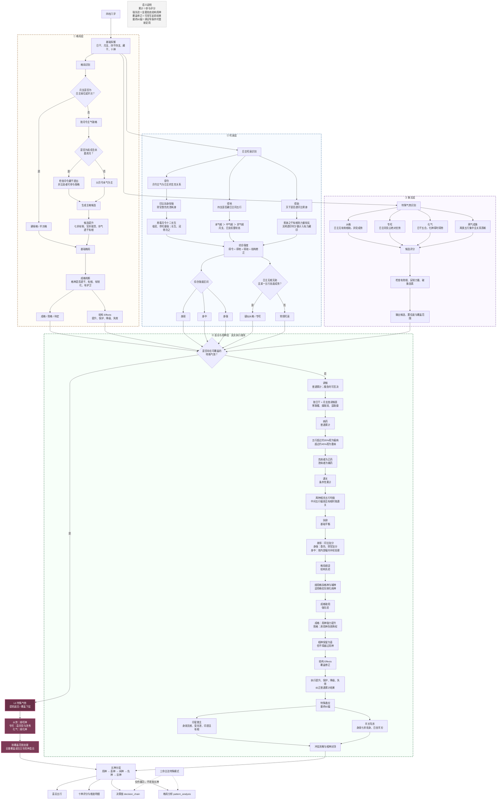

# BaziEngine 原局决策架构

> 当前基线：BaziEngine `1.8.28`
> 文档日期：2026-07-09
> 范围：四柱进入规则引擎后，格局、旺衰、象法、成格和喜忌五神的原局决策链。

本文描述 `buildCompleteBaziDetail` 内部的确定性原局推演，不包含出生时间换算、LLM 文案生成、八字问事语义路由或仍处于 preview 阶段的专题派生能力。

## 1. 核心原则

- 格局、旺衰与象法从同一份四柱基础数据并行识别，不能把其中一项当成另外两项的简单前置结论。
- `L0` 专指能够提前返回或覆盖普通喜忌链的特殊气势；其余节点按真实执行顺序命名，不再使用容易误解的 `L1–L5`。
- 普通喜忌链不是简单的逐层裁决，而是“基础累计 → 结构先验 → 覆盖修正 → 最终纠偏”。
- `decision_chain` 是面向解释的摘要；完整审计应同时查看 `dimension_breakdown`、`chengge_detail.patternEffects` 与 `image_analysis`。
- 《三命通会》特殊模式目前属于展示层信号，不直接改写五神结果。

## 2. 输入、中间产物与输出

### 2.1 输入

| 输入 | 内容 |
| --- | --- |
| 四柱 | 年柱、月柱、日柱、时柱 |
| 日主 | 日干，作为十神与旺衰判断中心 |
| 基础关系 | 四干、四支、藏干、十神、十二长生、五行 |

### 2.2 核心中间产物

| 产物 | 作用 |
| --- | --- |
| `geJuInfo` | 基础格局、取格依据、月支合化信息、主格候选 |
| `strengthResult` | 得令、得地、得助、结构修正和身强弱结论 |
| `imageAnalysis` | 从格、专旺、化气、两气成象候选及覆盖范围 |
| `chengGeDetail` | 成格、败格、待定、用神、相神及结构 Effects |
| `favorableResult` | 十神评分、五神、喜忌五行、维度明细与决策链 |
| `patternAnalysis` | 面向产品展示的结构化格局分析 |

### 2.3 输出

- 五神：用神、喜神、闲神、仇神、忌神。
- 喜忌五行与十神评分。
- 格局、成格状态、特殊气势和判断依据。
- 可审计的维度分解与决策摘要。

## 3. 原局决策流程

## 4. 普通喜忌链的执行语义

| 顺序 | 环节 | 语义 |
| ---: | --- | --- |
| 1 | 调候 | 按日干、月支及优先干累计；极端寒燥湿热时具有否决能力 |
| 2 | 病药 | 识别五行偏枯，以克病者为正药、泄病者为辅药 |
| 3 | 通关 | 仅在两气交战、桥接五行不足且有根时成立 |
| 4 | 扶抑 | 根据身弱、身中、身强提供基础平衡分 |
| 5 | 格局顺逆 | 为格神与制化辅神提供结构先验 |
| 6 | 成格取用 | 成格用神获得强先验；败格用神与相神降权 |
| 7 | 结构 Effects | 对具体十神执行提升、保护、降级或失效 |
| 8 | 特殊救应 | 印星救主、羊刃驾杀等窄条件最终纠偏 |
| 9 | 冲突消解 | 保护有效结构，并将相神封顶在用神以下 |

这里的顺序是代码计算顺序，不等于理论重要性排序。例如成格虽然在扶抑之后执行，但其强先验和结构 Effects 可以覆盖此前的普通累计结果。

## 5. 本轮调优汇总

当前 `1.8.28` 基线融合了近期多轮八字准确度调整：

- 主格候选不再只依赖月令本气，补入七杀有制、官杀去留、墓库杂气透干等高置信候选。
- 成格结果正式进入喜忌评分，增加用神强先验及 protected、promoted、demoted、invalidated、assistant 五类 Effects。
- 相神采用“喜但不得夺用”的封顶语义，避免辅助十神反超真正用神。
- 旺衰由简单计数升级为得令、得地、得助与结构修正的 10 分制，并补入禄刃旺地、藏印、根网、湿土季节性等校准。
- 象法增加从格、专旺、化气、两气成象评分；只有满足覆盖范围和护栏的候选才能进入 `L0`。
- 增加穷通专用规则、印星救主、羊刃驾杀与高置信结构保护，处理普通累计无法表达的窄条件。
- 特殊格局断语增加材料来源和评分挂钩，区分参与判断的结构信号与仅供展示的古法标签。

## 6. 验证基线

2026-07-09 在 `preview` 基线执行 24 个高置信经典命例：

| 指标 | 结果 |
| --- | ---: |
| 严格加权准确率 | 91.1% |
| 核心准确率（不含方法原词召回） | 95.7% |
| 用神 Top 1 | 91.8% |
| 喜忌方向 | 100% |
| 格局 | 92.3% |
| 象法 | 100% |
| 严重错误 | 0 |

该命例集没有旺衰人工真值，因此不能把上述结果外推为旺衰准确率。

## 7. 代码映射

| 环节 | 主要实现 |
| --- | --- |
| 总编排与输出契约 | `lib/baziCore.js#buildCompleteBaziDetail` |
| 基础格局 | `lib/baziCore.js#BaziEngine.getGeJu` |
| 成格与结构 Effects | `lib/baziCore.js#getChengGe` |
| 旺衰 | `lib/BaziRuleEngine.js#calculateStrength` |
| 喜忌五神 | `lib/BaziRuleEngine.js#getFavorableUnfavorable` |
| 象法与特殊气势 | `lib/baziImageAssessor.js` |
| 产品化格局输出 | `lib/baziCore.js#buildPatternAnalysis` |
| 经典命例回归 | `fixtures/classical-golden-cases/`、`scripts/eval-classical-goldcases.mjs` |

## 8. 能力边界

- `decision_chain` 是解释摘要，不保证逐条呈现所有内部加减分。
- LLM 只负责将规则结论组织成自然语言，不应重新排盘或推翻规则引擎结果。
- 本文不纳入仍在 preview 阶段的专题派生能力；专题层不能反向静默改写原局格局、旺衰或五神。
