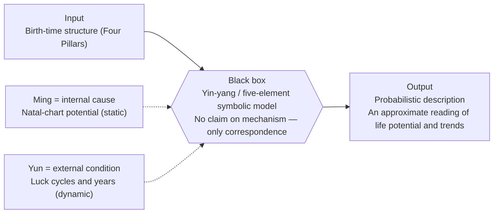
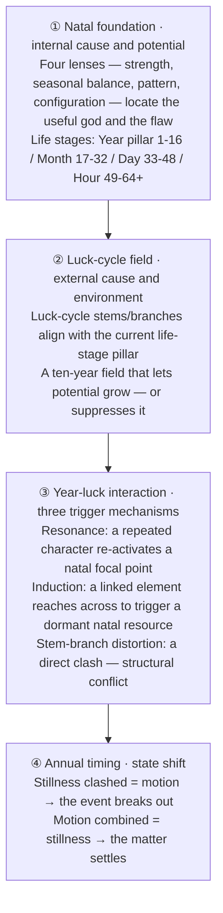

# Qimen Dunjia · AI Decision Engine

> **A classical framework for structure and change, rebuilt as a modern AI reasoning system — and reconnected to the language modern psychology uses to describe the self.**  
> Spatiotemporal situation modeling × individual disposition-structure analysis × cross-validation with psychology × classical case validation × dual-axis semantic routing × auditable reasoning trail × Gemini × Vue

> *"When a structure is exhausted, it changes; having changed, it finds a way through; having found a way through, it endures."* — I Ching. Change itself is not the exception, it is the object of study — that is this project's starting point, and the line that separates it from fortune-telling.

<p align="center">
  
  &nbsp;&nbsp;
  
  &nbsp;&nbsp;
  
</p>

<p align="center">
  <a href="../../README.md">简体中文</a> |
  English |
  <a href="./README.zh-TW.md">繁體中文</a>
</p>

---

## Overview

Most Bazi/Qimen tools either stop at chart generation or repeat mystical-sounding phrases without structure. This project aims for something different: **implement the "situation–time–action" structured framework at the heart of classical Chinese decision philosophy as a deterministic rule engine, and let AI handle expression — not let a language model improvise metaphysics out of nothing.**

Qimen Dunjia's nine-palace flying-star layout is, at bottom, a spatiotemporal model of how a situation's structure evolves over time. Bazi's stem-branch system is a structural model of how a person's innate disposition interacts with the life stage they're in. Both share the same underlying worldview — yin-yang oscillation, five-element generation and control — a plain relational ontology: things aren't isolated entities but a network of mutually constraining, rising-and-falling relations.

That thread connects to modern psychology in a way that's actually documented, not a flourish invented for this project: Carl Jung wrote the foreword to Richard Wilhelm's 1949 English translation of the I Ching, stating plainly that the book gave him the philosophical grounding for his theory of synchronicity — the idea that two events can be meaningfully connected without being causally connected. Jung considered the I Ching the oldest systematic method built on that principle; Wilhelm had introduced him to the text in the 1920s, and Jung kept using it in his own clinical practice for decades afterward. Following the thread further: Bazi's ten gods (peer / output / wealth / authority / resource) describe "the self's relationship to external resources, authority, and expression" — the same territory McClelland's need theory (achievement / power / affiliation) maps from a different symbolic system. The twelve life stages (birth → peak → decline → death → storage → dissolution → gestation → nurture) tell the same kind of staged growth-peak-decline-renewal story as Erikson's eight stages of psychosocial development or Levinson's *The Seasons of a Man's Life*. And the way a luck cycle "activates" dormant natal potential is close to the same claim as trait activation theory (Tett & Guterman, 2000): a stable disposition stays latent until a matching situational cue brings it out as behavior. None of this means the two are the same theory — they're independent structural solutions to the same underlying problem, arrived at from different traditions. The boundary matters here: this is a methodological parallel, not a claim that yin-yang and the five elements have been "proven" by psychology. They haven't passed psychometric validity and reliability testing, and they aren't equivalent to a scale like the Big Five or the MBTI. What this system can actually claim is narrower and more honest: it offers a structurally complete, millennia-refined language for describing the self and its situation — and that language's usefulness doesn't depend on whether its causal mechanism is real, the same way narrative therapy doesn't need a client's life story to be metaphysically true in order to produce real psychological benefit.

After a user asks a question, the system first decides which framework should answer it: the situation model (Qimen), the disposition-structure model (Bazi), or a combined reading. The routing layer identifies the question type first, then hands the matching structural rules, chart context, and real-world background to the reasoning engine.

The situation model handles concrete events, short-term decisions, and timing windows. The disposition-structure model handles individual structure, life-stage trends, and long-term fit. The rhythm-scoring module handles daily / weekly / monthly / yearly state quantification and actionable guidance. Deterministic local rules do the objective computation; the language model only translates the structured conclusion into readable, actionable language — it doesn't judge, it translates.

This isn't a new skin on a fortune-telling app. It's a system that **does structured reasoning first and uses language second — instead of using language to manufacture mystery.**

---

## The Epistemology Behind the Reasoning

Before any technical design, there's a more basic question to answer: **what is this system actually claiming?** This isn't packaging invented for this project — it is the stance Lu Zhiji lays out in *In Search of Destiny* and *A Course in Dynamic Bazi Analysis*, the closest thing this tradition has to a modern, scientific self-description:

> "Ming (命) is the basis; yun (运) is the environment. Ming is the internal cause; yun is the condition. Bazi theory studies how ming and yun interact to reveal the rise and fall of a person's life."

> "The input to this black box is a person's birth moment. The output is a description and prediction of that person's life potential and trajectory." — He names the fundamental limit of Bazi theory as **probabilistic description**: an approximate prediction grounded in observed correlation, not a theological claim of absolute causal determinism.

He borrows the "black box" concept from cybernetics to position the system: it makes no claim to open the box and understand fate's ultimate mechanism — it only observes that the correspondence between input (birth-time structure) and output (life potential and trajectory) "is not arbitrary."



One layer down is his operational methodology — "dynamic analysis" — four progressive stages describing how potential is activated into concrete events over time:



The natal chart is the potential (the seed); the luck cycle is the environment (the field); the year is the trigger (the spark) — together they decide whether a given event breaks out in a given year, not whether the natal chart alone writes the ending. This four-stage framework is the theoretical source for concepts like life-stage alignment, resonance, and linked-element induction in the project's engineering implementation, and it directly drives every engineering decision below: why scoring runs on a rule engine instead of a prompt, why the same question must produce a consistent conclusion regardless of which model answers it, and why low-confidence questions must be explicitly flagged as "cannot be strongly judged."

---

## Core Features

### Changelog

**2026-07-09 · BaziEngine 1.8.28 · Natal-accuracy calibration release**

Consolidates recent pattern, strength, and configuration-image tuning into a single natal-decision spec. Full conditions, execution order, and the Mermaid flow are documented in [`../bazi-engine-architecture.md`](../bazi-engine-architecture.md).

- Unified the natal decision chain: pattern, strength, and configuration-image are evaluated in parallel, then feed into the pattern-formation and favorability chains.
- Calibrated pattern-formation candidates (seven-killings with control, official/killings retention, storage-stem exposure); promoted / demoted / invalidated pattern effects now formally weigh into favorability scoring.
- Unified strength scoring to a 10-point scale (seasonal command, rootedness, support, structural correction); added special-configuration scoring (follow-patterns, dominant-qi, transformation) gated by effective roots and counter-forces.
- Fixed the favorability execution order: seasonal balance → symptom/remedy → mediation → support/restraint → pattern direction → pattern-formation useful god → structural effects → special rescue → conflict resolution.
- Regression on 24 high-confidence classical cases: 91.1% weighted accuracy, 95.7% core accuracy, 91.8% top-1 useful-god accuracy, 100% favorability direction, 92.3% pattern accuracy, 100% configuration-image accuracy, 0 severe errors.

**2026-06-25 · Qimen Skill consolidation + palace-depth field tuning**

Consolidated the full Qimen question flow into a reusable Agent Skill (see "Qimen Dunjia Agent Skill" below) and filled in palace-depth fields the scoring engine previously lacked, so deep readings can cite real data instead of the model inventing detail.

- Added stem-relation data (`getStemRelation`) showing the generation/control direction between each palace's heaven and earth stems.
- Named-pattern hits now record which palace they land in, instead of floating generic symbolism.
- Fixed a prosperity gap: nine-star seasonal prosperity was never fed into palace evaluation in production; the "structural strength decides outcome" veto tier is now actually active.
- Skill reporting discipline: casting time follows "the moment of asking," with the event's own time treated as background only; reports render the Luoshu grid up front and require a second-layer palace-depth reading for the core useful-god palace.

**2026-06-13 · Question Follow-ups (multi-turn deep-dive)**

Both Qimen and Bazi questions now support follow-up deep-dives on top of the original reading, via two new streaming endpoints `/api/qimen-followup` and `/api/bazi-followup`.

- **One casting, one reading; the original is never rewritten**: follow-up results are appended as sub-blocks under the relevant sections — they never overwrite the original, never recast the chart, and never re-score. A casting's verdict and score are fixed the moment it is cast; follow-ups only change the angle and add depth.
- **Deepen / new-matter classifier**: a lightweight model first decides whether a follow-up is a "same-casting deep-dive" or a "new matter." A new matter immediately prompts a recast instead of spending the main model.
- **Deterministic supplemental computation**: if a follow-up needs years, luck cycles, or timing the original chart didn't compute, the classifier requests them from a whitelist and the backend computes them deterministically. The model only ever reads the results — no function calling.
- **Anti-fabrication carries over**: the patch model may only cite the chart evidence passed back from the frontend, must not introduce new chart elements, and must not leak internal metrics. A revision is shown as "original verdict → adjusted to … (given the new information)," never a silent overwrite.

**2026-06-10 · Streaming questions with self-healing retry**

Moved the question engine from "emit one big JSON at the end" toward "stream as it computes, self-heal on failure, switch models per environment, and never fabricate or leak internal metrics."

- A sentinel-segment protocol (`<<<SEC:...>>>`) streams each user-facing prose section independently; rule-engine output renders first and AI prose fills in section by section.
- A hard structural check (empty stream / missing core sections / unparseable `data_json`) fires an `llm_retry` event that clears the half-rendered content back to the skeleton, then retries once non-streaming; missing optional fields fall back silently.
- The title is split into a standalone streamed section that names the question type and core verdict instead of duplicating it inside the structured JSON.
- A new `QUESTION_MODEL` env var configures the question model per environment (code default falls back to `gemini-3.1-pro-preview`; both environments currently run `gemini-3-flash-preview`).
- Anti-fabrication and transformation-pattern guards: prompts reference only chart / Four-Pillars fields actually returned by the backend, and no internal quantitative value ("strength 74.4," "energy 80," "confidence 0.8") may reach user-facing copy — these are expressed qualitatively.

**2026-06-06 · Evaluable rules, same-source pages, replayable history**

Moved Bazi questions from "does the model sound right" toward "can the rules be evaluated, is the page sourced from the same engine, and can history be safely replayed."

- Useful-god / target ten-god evaluation: added [`../eval/yongshen-eval-2026-06.md`](../eval/yongshen-eval-2026-06.md) and [`../../scripts/eval-yongshen.mjs`](../../scripts/eval-yongshen.mjs), comparing the local rule engine against textbook cases and labeling each as match / partial / deviation.
- Dual-axis semantic routing: Bazi questions split the old single-axis `status/timing/pattern/character` into `framework` and `target_source`.
- Bazi dynamic panel picking: target ten gods, palaces, and luck-cycle activation are picked from `state_report`, `dynamic_report`, and `timing_candidates`, so the page stays sourced from the rule engine; low-confidence paths degrade explicitly.
- History compatibility: the old `analysis_mode` migrates to the new dual-axis semantics, so stored questions still replay.

**Earlier feature evolution**

- The fortune page expanded from a single daily view to daily, weekly, monthly, and yearly views.
- Weekly fortune: seven-day curve, favorable / cautious days, weekly label, and career / wealth / relationship reminders.
- Monthly fortune: score curves, high / low days, difficult-period hints, and plain-language readings across general / career / wealth / relationships.
- Yearly fortune: a multi-year range with luck-cycle background, annual ten-god signals, and year-cycle relationships.
- Bazi profiles gained decision notes for career, finance, relationship, and health/lifestyle context, keeping monthly readings closer to real life.
- Qimen result pages keep a validation feedback entry for marking whether a reading was accurate.

### Divination Routing Engine

This is the system's dispatcher. Every question is first classified as a concrete event, a long-term structural question, or one that needs both frameworks together — that classification step is itself the epistemology in practice: decide what *kind* of question this is before deciding how to answer it, instead of running one generic script for everything.

- Automatically decides whether a question should use Qimen, Bazi, or a combined reading
- Covers common domains such as career, finance, relationships, health, lost items, exams, legal matters, feng shui, pregnancy, and miscellaneous decisions
- Injects domain-specific rules, chart context, and real-world background into the interpretation flow
- Asks for missing information before attempting a reading when the question is underspecified

### Qimen Dunjia Reading

- Implements the Shi Jia Qimen turning-board method, including Jiazi hiding, Fu Tou positioning, nine stars, eight gates, and eight spirits
- Handles key chart signals such as Tian Rui, Tian Qin lodging in Kun, emptiness, and traveling-horse indicators
- Switches useful-god rules by question domain instead of applying one generic interpretation to every case
- Produces a situation score, risk signals, timing windows, favorable directions, favorable time ranges, and concrete suggestions
- Supports same-casting follow-up deep-dives without recasting or re-scoring, appending the answer under the relevant sections
- Supports reading history and validation feedback for later calibration

### Qimen Dunjia Agent Skill (conversational reasoning skill)

Consolidates the Qimen event pipeline above into a technique an AI agent can call directly ([`docs/skills/qimen-dunjia/SKILL.md`](../skills/qimen-dunjia/SKILL.md)), so a conversational casting shares the same deterministic rule foundation as the web app instead of letting the model freelance.

- **Interview first, cast second**: a structured interview confirms the matter, casting time, timezone, and judgment target before any casting; missing information is asked for, not guessed
- **Fixed pipeline, no skipped steps**: structured interview → question routing → fixed casting → target-spec resolution → bounded scoring → timing scan → single evidence package → free-form report — the engine is never bypassed for freestyle reading
- **Four hard rules**: chart facts must come from the script; low-confidence targets may be derived by the model but must pass a whitelist and chart check; model-derived targets can only participate in scoring in a bounded, capped way; the report's structure is free-form, but key content (direct answer, reasoning, evidence, risk, timing, advice, limitations) may never be omitted
- **Casting-time convention**: Shi Jia Qimen casts at "the moment of asking" (Beijing time, script-resolved hour); any event time the user mentions is background only, never the casting time
- **Report conventions**: renders the Luoshu nine-grid up front, expands named patterns by the palace they land in, reads seasonal strength and heaven/earth stem relations palace by palace, and closes with a note on the reasoning's boundaries

### Bazi System

- Supports Gregorian input, lunar input, and direct Four Pillars input
- Supports birthplace search, longitude, mean solar time, and true solar time correction
- Expands stems, branches, ten gods, hidden stems, twelve growth phases, Na Yin, emptiness, spirits, and special patterns
- Uses a local rule engine for day-master strength, favorable elements, pattern judgment, and generation-control relationships
- Documents the [BaziEngine natal decision architecture](../bazi-engine-architecture.md), specifying execution order and override relationships among pattern, strength, configuration-image, pattern-formation, and the five favorability gods
- Provides five-element power visualization, scoring details, Bazi Q&A, feedback-based recalibration, and decision notes
- Supports follow-up deep-dives on the same natal chart, presenting new information as "original verdict → adjusted to …" rather than a silent overwrite
- Supports linked luck pillars, annual cycles, and monthly cycles to show how the natal chart interacts with current time

### Fortune Scoring

| Range | What It Does |
| --- | --- |
| Daily | Computes the daily score and shows insight cards, timeline, favorable hours, and guidance |
| Weekly | Builds a natural-week seven-day curve, weekly label, key dates, solar-term turns, and action reminders |
| Monthly | Uses solar terms for month boundaries and shows monthly curves, high-score days, low-score days, difficult periods, and readable scoring reasons |
| Yearly | Generates a multi-year range with luck-cycle context, annual ten-god signals, natal interactions, spirit indicators, and readable scoring reasons |

Monthly detailed readings support four dimensions: general, career, wealth, and relationships. Users can provide long-term context and current-month background, which are then injected into the reading.

### Reasoning Engineering Dashboard

- Breaks complex reasoning workflows into clear roles and steps
- Provides a centralized view of rules, cache state, engine status, and interpretation flow
- Helps advanced users or administrators inspect the reasoning pipeline

### Guest, Auth, and Commercial Flow

- Supports email login, Google login, and password reset
- Guest mode allows one Qimen question, one local Bazi profile, and today's fortune score
- Guest events filter sensitive fields such as names, birth dates, and question text
- Bottom navigation adapts to signed-in and guest states; password reset hides the main navigation

---

## Reasoning Architecture

```text
User question
  │
  └─► Divination routing engine
        │
        ├─► Qimen Dunjia: concrete events, short-term decisions, timing
        ├─► Bazi: natal structure, long-term cycles, industry fit
        ├─► Combined reading: natal background × current event
        └─► Clarification: collect missing context before reading
              │
              └─► Domain rule injection
                    │
                    └─► Main reasoning engine
                          │
                          └─► Structured decision card
```

### Question Reasoning Pipeline

The question engine is no longer a single Bazi Q&A flow. After the user enters a question, the system first decides whether the situation is better handled by Qimen, Bazi, or a combined reading. If the question is too vague, it asks for the missing context first. Each branch uses a different calculation path, and the language model only turns the rule-based conclusions into readable guidance. After any reading, a **follow-up** can deepen it: without recasting or re-scoring, the follow-up answer is appended under the relevant sections; if it falls outside the casting it is treated as a new matter and prompts a recast — the same principle as "structure is fixed the moment it is cast": new evidence can add depth, but it cannot quietly rewrite a judgment already made.

The detailed Bazi branch design is documented in [`../bazi-prompt-assembly-prd.md`](../bazi-prompt-assembly-prd.md), and the Qimen scoring notes are in [`../qimen-scoring-engine-improvement.md`](../qimen-scoring-engine-improvement.md).

```text
User question
    │
    ▼
┌─────────────────────────────────────┐
│  Top-level divination routing         │
│  · Long-term chart question or event  │
│  · Career, wealth, relationship, etc. │
│  · Active side or waiting side        │
│  · Ask follow-up questions if needed  │
└────────────────┬────────────────────┘
                 │
        ┌────────┼────────┬────────┐
        ▼        ▼        ▼        ▼
   Clarify     Qimen      Bazi      Combined
   missing     event      natal     natal context ×
   context     path       path      current event
```

#### Qimen Event Path

Use this path for concrete situations: whether to accept an offer, whether an interview can succeed, whether a project will move forward, whether someone will reply, whether a lost item can be found, or whether a certain time is favorable.

```text
Concrete question + current time
    │
    ▼
Qimen chart generation
    │
    ├─► Identify domain and active/waiting role
    ├─► Select useful gods and supporting signals
    ├─► Calculate palaces, emptiness, traveling horse, chief star, and chief gate
    ├─► Produce rule-based situation score and risk signals first
    ├─► Scan usable time windows for activation or breakthrough points
    └─► Let AI review domain, useful gods, score, and timing before producing the card
```

#### Bazi Natal Path

Use this path for long-term structure: career direction, wealth capacity, relationship structure, constitution tendencies, or which years are more likely to open a window. The Bazi branch chooses a different sub-path depending on the question:

| User Question | Reasoning Path | Main Focus |
| --- | --- | --- |
| "How is my relationship luck this year?" | Current-state reading | Natal baseline, current luck cycle, and whether the current year activates the target area |
| "Which year in the next five years is better for changing jobs?" | Timing-window reading | Scans candidate years and identifies stronger windows and years to avoid |
| "Am I better suited to starting a business or working a job?" | Open-strategy reading | Natal favorability, life-stage climate, and trade-offs across paths |
| "What kind of partner am I likely to attract?" | Character-profile reading | Tendencies shown by ten gods, palace positions, and relationship structure |
| "This cannot be strongly judged from Bazi" | Boundary reading | States the limitation clearly and only offers a low-confidence observation frame |

```text
User question + Bazi profile
    │
    ▼
Bazi semantic refinement
    │
    ├─► Identify domain, time range, and target of judgment
    ├─► Choose current-state / timing-window / structure / character-profile / open-strategy path
    └─► Correct low-confidence or conflicting signals to avoid forcing the wrong rule
          │
          ▼
Target element resolution
    │     Locate the core ten gods, palaces, and supporting signals for this question
          │
          ▼
Natal-state assessment
    │     Check position, strength, visibility, clashes, combinations, harm, and storage
          │
          ▼
Dynamic activation assessment
          Current state: whether the current luck cycle and year activate the target
          Timing window: scan and rank candidate years
          Structure: focus on natal structure, with current-stage notes if needed
          Open strategy: compare multiple paths using natal favorability and life-stage climate
          Character profile: describe tendencies without asserting facts
          Boundary path: explain the limit and downgrade to an observation frame
          │
          ▼
Reading assembly
          Target elements, natal baseline, dynamic activation, and limitations are
          assembled into natural language. AI expresses and organizes the result;
          it does not recalculate the chart or invent stem-branch relations.
```

#### Combined Reading Path

Use this path when the question contains both long-term natal background and a concrete current event, such as "How is my career luck this year, and should I accept this offer?" The Bazi profile provides the person's current baseline and stage; the Qimen path judges the concrete event, risks, timing, and action window.

```text
Bazi profile
  └─► Natal baseline, current luck cycle, favorable and unfavorable tendencies
          │
          ▼
Concrete event + current time
  └─► Qimen chart, useful gods, score, timing, and breakthrough suggestions
          │
          ▼
Combined result
  Long-term trends do not replace event judgment;
  event judgment is not detached from the user's current stage.
```

### Fortune Scoring Framework

Fortune scores are produced by deterministic local rules; the language model does not decide the score. Daily, weekly, monthly, and yearly numbers are not generated from a prompt. The engine first reads the natal chart, then checks how the current time activates that chart, and finally turns the matched signals into an explainable score and guidance. The detailed engineering design is in [`../bazi-score-engine-prd.md`](../bazi-score-engine-prd.md).

```text
Bazi chart
    │
    ▼
Favorable and unfavorable tendencies
  Identify which elements and ten gods are supportive, neutral, or stressful for the person
    │
    ▼
Seasonal adjustment
  Check whether the current climate supports what the chart needs, or intensifies imbalance
    │
    ▼
Time-factor layering
  Daily: immediate effect of the day's stems and branches
  Weekly: seven-day rhythm and dominant energy
  Monthly: solar-term month, monthly rhythm, difficult periods, and key dates
  Yearly: luck-cycle background and annual climate
    │
    ▼
Explainable score
  The score is shown with supportive factors, risk factors, and action guidance
```

**Theoretical Basis**

The scoring framework is distilled from the author's private NotebookLM study notes on Bazi cases:

| Source | Role in Scoring |
| --- | --- |
| *Di Tian Sui*: useful gods as medicine, unfavorable gods as illness | First determine whether the current time supports the chart or amplifies pressure |
| *Qiong Tong Bao Jian*: seasonal balance comes first | Check cold, heat, dryness, and dampness before judging specific outcomes |
| Case-study principle: clashes outweigh many minor branch signals | Treat clashes, punishments, combinations, and harms in layers instead of absolutizing a single signal |
| *San Ming Tong Hui*: the annual ruler carries major influence | Yearly readings give special attention to how the current year activates the stage |
| Case-study principle: nobleman stars without vitality may not help | Spirit indicators are auxiliary and must be read with strength, favorability, and emptiness |
| Lu Zhiji's dynamic analysis theory: natal state → luck-cycle activation → timing | First check whether the natal chart has a basis, then whether time truly activates it |

> The NotebookLM material is private study material. This README shows the framework only; concrete rules and weights remain in engineering docs and source code.

---

## Tech Stack

```text
Frontend       Vue 3, Composition API, Pinia, Vue Router, vue-i18n
Backend        Cloudflare Workers
Database       Supabase Auth, Postgres, row-level security
AI             Gemini-compatible API (question model set per environment via QUESTION_MODEL, currently flash), SSE streaming
Calendar       lunar-javascript
Build Tool     Vite
Tests          Node.js Test Runner
Production     Cloudflare Pages + Cloudflare Workers
```

### Engineering Notes

- **Deterministic scoring**: daily, weekly, monthly, and yearly scores are produced by local rule engines; the model cannot overwrite them
- **Structured reasoning paths**: questions are first routed to Qimen, Bazi, or a combined reading; the Bazi branch then chooses current-state, timing-window, structure, or character-profile paths
- **Streaming questions with self-healing retry**: questions stream via a sentinel-segment SSE protocol, rendering rule output first and filling AI prose section by section; a failed structure check (empty stream / missing core sections / unparseable data_json) auto-clears the half-rendered content and retries once non-streaming
- **Question follow-ups**: Qimen / Bazi support same-casting deep-dives; a classifier first splits "deepen / new matter," supplemental data is computed deterministically from a whitelist, and the model only reads results — appending, never overwriting the original
- **Switchable question model**: the `QUESTION_MODEL` env var configures the question model per environment (code default falls back to pro); both environments currently run flash to compare stability and quality
- **Anti-fabrication guardrails**: prompts strictly constrain the AI to reference only the backend's actual chart / Four-Pillars fields, forbid inventing symbols or generation-control relations that don't exist, and forbid leaking internal quantitative metrics into user-facing copy
- **Layered caching**: daily, weekly, monthly, yearly, and monthly detailed readings are stored in the database and cached on the frontend
- **Warmup flow**: signed-in users can preload the next seven daily readings
- **Fallback behavior**: Bazi readings fall back to local rules when model generation fails; fortune pages can still show scores before prose is ready
- **Test coverage**: covers CORS, Bazi APIs, guest mode, caching, warmup, monthly fortune, yearly fortune, and core UI constraints
- **Context injection**: long-term profile notes and current-month context are stored separately and injected into monthly detailed readings
- **Audit trail**: Qimen and Bazi question flows keep route, rule, prompt, model-output, and post-processing snapshots for calibration
- **Single backend entry point**: backend routes are centralized in `worker/src/index.js` for easier maintenance and review

---

## Local Development

```bash
npm install
npm run dev
npm test
npm run build
```

### Backend Local Debugging

```bash
cd worker
npx wrangler dev
```

The backend starts at `http://localhost:8787`, and the frontend proxy forwards `/api/*` requests to that address.

---

## Operations

This is a personal website maintained by the author. The live service runs on Cloudflare Workers, Cloudflare Pages, Supabase, and a Gemini-compatible model endpoint. This document describes the project shape and local development flow only; it does not provide public deployment instructions, secret configuration, or self-hosting steps.

Database migration scripts are kept in `docs/sql/` for the author's own maintenance and feature evolution.

---

## Project Structure

```text
/
├── worker/          # Backend API entry point and Cloudflare Workers config
├── lib/             # Qimen, Bazi, fortune scoring, and prompt-building core logic
├── src/             # Vue frontend app
├── docs/sql/        # Database migration scripts
├── mock/            # Guest-mode and test mock data
├── public/          # Static assets and SPA fallback config
├── archive/         # Historical APIs and old prototypes
└── package.json
```

---

## Screenshots

<p align="center">
  
  &nbsp;
  
</p>

**Qimen result cards include:**

- Situation score, five-part interpretation, scoring rationale, and risk tags
- Nine-palace chart visualization with chief star, chief gate, emptiness, and traveling-horse markers
- Timing windows, favorable directions, favorable time ranges, and action notes
- Validation feedback entry on the result page

<p align="center">
  
  &nbsp;
  
  <br/>
  
</p>

**Bazi panels include:**

- Gregorian, lunar, and Four Pillars input, with birthplace and true solar time correction
- Ten gods, hidden stems, growth phases, emptiness, Na Yin, spirits, and detailed chart view
- Linked luck pillar, annual, and monthly timelines
- Generation-control visualization and recalibrated interpretations

<p align="center">
  
  &nbsp;
  
</p>

**Fortune panels include:**

- Daily: seven-day switching, score-first rendering, asynchronous prose, favorable hours, and guidance
- Weekly: natural-week switching, seven-day curve, favorable/cautious days, weekly labels, and event reminders
- Monthly: solar-term month boundaries, monthly score curve, high and low days, difficult periods, and multi-dimensional detailed readings
- Yearly: multi-year range, luck-cycle context, annual ten-god signals, natal interactions, and yearly indicators
- Profile switching and frontend cache replay

---

## Design Principles

**Honest readings**

The prompts explicitly forbid raising the score just because a question sounds positive. Difficult signals must be shown honestly; favorable signals only matter when the structure supports them.

**Algorithmic authority**

Day-master strength, favorable elements, and daily, monthly, and yearly scores are generated by deterministic local engines. The language model is the expression layer, not the scoring authority.

**Context shapes meaning**

The same chart signal can mean different things in career, relationships, health, competitions, or transactions. The system uses question domains, Bazi profiles, and real-world context to ground each interpretation.

**A probability map, not a verdict of fate**

Qimen and Bazi hand you a reference for "which paths look smoother, which moments deserve attention, given the current structure" — not an assertion that things will definitely turn out one way. The structure sets the terrain; the person is still the variable. Whether it works out still comes down to how the person in it chooses and acts.

---

## Credits

- Lu Zhiji, *In Search of Destiny* / *A Course in Dynamic Bazi Analysis* — dynamic analysis theory (target element → natal state → luck-cycle activation)
- [lunar-javascript](https://github.com/6tail/lunar-javascript) — sexagenary calendar calculations
- [Google Gemini](https://deepmind.google/technologies/gemini/) — AI reasoning engine
- [Supabase](https://supabase.com) — database and authentication
- [Vue 3](https://vuejs.org) — frontend framework
- [Vite](https://vitejs.dev) — build tooling
- [Cloudflare Workers](https://workers.cloudflare.com) — serverless backend runtime

---

## License

MIT License. You may use, modify, and distribute the code while preserving the original author notice.

> Structure can be reasoned through; the choice is still yours.  
> This system can tell you roughly what shape the situation takes — it can't take the steps for you. It hands you a map, not your footing.
