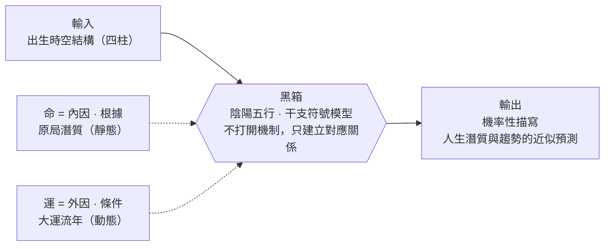
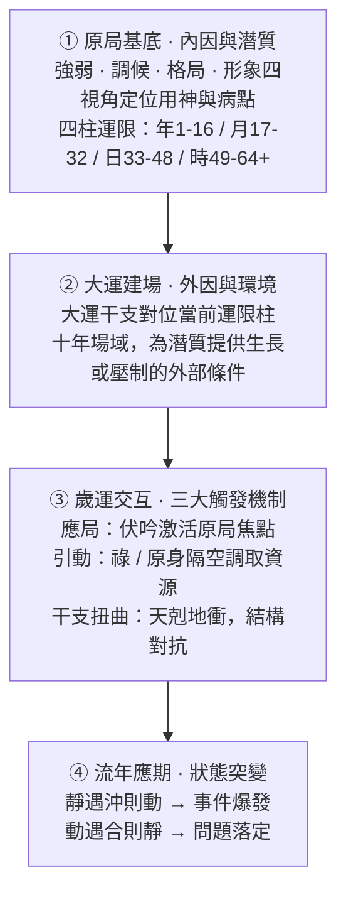

# 奇門遁甲 · AI 決策引擎

> **把一套關於結構與變化的古典認知體系，接入現代 AI 推理引擎——也接上現代心理學的自我認知語言。**  
> 時空局勢建模 × 個體稟賦結構分析 × 心理學視角互證 × 古籍命例校驗 × 雙軸語意路由 × 可稽核推演過程 × Gemini 大模型 × Vue 全端應用

> *「窮則變，變則通，通則久。」* —— 結構終將變化，而變化本身可以被認知、被建模。這是整個專案的方法論起點，也是它與「算命」的分界線。

<p align="center">
  
  &nbsp;&nbsp;
  
  &nbsp;&nbsp;
  
</p>

<p align="center">
  <a href="../../README.md">简体中文</a> |
  <a href="./README.en.md">English</a> |
  繁體中文
</p>

---

## 專案簡介

多數命理工具要麼只會排盤，要麼只會用玄妙辭藻反覆套模板。這個專案想做的是另一件事：**把中國古典決策哲學裡「情境—時間—行動」這套結構化認知框架，用確定性規則引擎實作出來，再讓 AI 負責表達，而不是讓大模型憑空生成玄學話術。**

拆開來看，奇門遁甲的九宮飛布，本質上是一套關於「局勢結構如何隨時間演化」的時空模型；八字的干支系統，本質上是一套關於「個體稟賦與所處階段如何相互作用」的結構模型。二者共享同一套底層世界觀——陰陽消長、五行生剋——這是一套樸素的關係本體論：萬物不是孤立的實體，而是彼此制約、此消彼長的關係網絡。

這條脈絡和現代心理學之間，其實有一段有據可查的交集，不是本專案自我美化出來的聯想：榮格（Carl Jung）1949 年為衛禮賢（Richard Wilhelm）的《易經》英譯本作序，明確說他從這本書裡看到了自己「共時性」（synchronicity）理論的哲學基礎——兩件事之間沒有因果關係，卻存在有意義的巧合關聯，榮格認為《易經》是歷史上最早系統化運用這條原則的方法，而衛禮賢早在 1920 年代就把《易經》引介給他，此後他用了數十年時間在自己的臨床實踐裡持續驗證。往下看，八字裡的十神（比劫 / 食傷 / 財 / 官殺 / 印）描述的是「自我與外部資源、權威、表達欲之間的關係模式」，這和 McClelland 成就動機理論關心的「人和世界打交道的幾種基本方式」是同一個問題的不同符號系統；十二長生把人生刻畫成長生、帝旺、衰、死、墓、絕、胎、養的階段性敘事，和 Erikson 的心理社會發展八階段、Levinson 的《人生四季》結構同源；歲運「引動」原局潛質的機制，和人格心理學裡的特質激活理論（Trait Activation Theory，Tett & Guterman, 2000）幾乎是同一個命題的兩種表述：穩定傾向平時潛伏，遇到匹配的情境線索才會顯現為行為。這些不是同一套理論，是同一批問題在東西方分別獨立求解出的結構相似解——需要說清楚邊界：這是方法論層面的結構互證，不是說陰陽五行「被心理學證明」了，它沒有經過心理測量學意義上的信效度檢驗，不能和 Big Five 或 MBTI 這類量表畫等號。這套系統真正站得住的價值主張是：它提供一套經過千年打磨、結構完整的自我與情境認知語言，這套語言有沒有用，不取決於它的因果機制是否成立，就像敘事療法不需要來訪者的「人生故事」在形而上學意義上為真，也能產生真實的心理效用。

使用者提問後，系統會先判斷這道題該用哪套框架回答：局勢模型（奇門）、稟賦結構模型（八字），或兩者聯合推演。分流模組先識別問題類型，再把對應的結構規則、命盤脈絡與現實語境交給推演引擎處理。

局勢模型負責具體事件、短期決策、時機窗口；稟賦結構模型負責個體結構、階段趨勢、長期適配；節奏評分模組負責日、週、月、年的狀態量化與可執行建議。客觀計算由本地規則引擎完成，大模型只負責把結構化結論轉譯成可讀、可行動的語言——它不做判斷，只做翻譯。

這不是給算命應用換一層皮，是一套**先做結構化認知，再用語言表達，而不是用語言製造神秘感**的推演系統。

---

## 推演背後的認識論

在動手做技術設計之前，先要回答一個更根本的問題：**這套系統到底在斷言什麼？** 這個立場不是本專案自己發明的包裝話術，而是陸致極在《命運的求索》《八字命理動態分析教程》裡給出的、體系內部最接近現代科學方法論的自我定位：

> 「命是根據，運是環境；命是內因，運是條件。命理學就是探討『命』和『運』的相互作用，來揭示和展現一個人豐富多彩的人生起伏軌跡。」

> 「作為這個黑箱的輸入，是一個人的出生時辰。作為黑箱的輸出，是關於這個人的生命潛質和人生歷程的描寫和預測。」——他將命理學的根本侷限首先歸結為**「機率性描寫」**：這是一種基於經驗觀察的近似預測，而非神學式的絕對因果決定。

他借用控制論的「黑箱」概念自我定位：不宣稱打開黑箱、理解命運的終極機制，只觀察輸入（出生時空結構）與輸出（人生潛質與趨勢）之間「不是雜亂無章」的對應關係。



再往下一層，是他給出的可操作方法論——「動態分析」四個遞進環節，講清楚「潛質如何在時間中被激活為具體事件」：



原局是潛質（種子），大運是環境（場域），流年是觸發（導火線）——三者共同決定「某個具體年份會不會爆發某件事」，而不是原局本身就寫死了結局。這套四環節框架，正是本專案工程實作裡「運限並軌」「應局」「祿 / 原身引動」幾個概念的理論來源，也直接決定了下面所有工程決策：為什麼算分要用規則引擎而不是提示詞，為什麼同一句話不同模型要給出一致結論，為什麼低置信問題必須顯式標註「不能強斷」。

---

## 核心能力

### 更新歷史

**2026-07-09 · BaziEngine 1.8.28 · 原局準確度調優整合版**

把近期格局、旺衰、象法與喜忌調優收束為同一版原局決策說明。完整判斷條件、執行順序與 Mermaid 流程圖見 [`../bazi-engine-architecture.md`](../bazi-engine-architecture.md)。仍在 preview 階段的專題衍生能力不納入本次版本。

- **原局決策鏈統一**：四柱進入引擎後並行識別格局、旺衰與象法，再彙入成格和喜忌鏈；`L0` 僅保留給會提前返回或覆蓋普通鏈的特殊氣勢，其餘節點按真實執行順序描述。
- **格局與成格校準**：補入七殺有制、官殺去留、墓庫雜氣透干等主格候選；成格用神、相神和 protected / promoted / demoted / invalidated Effects 正式參與喜忌評分。
- **旺衰與象法校準**：旺衰統一為得令、得地、得助和結構修正的 10 分制；象法增加從格、專旺、化氣、兩氣成象評分，並以有效根、反制力量和破象條件控制特殊覆蓋。
- **喜忌執行順序明確**：普通鏈按調候 → 病藥 → 通關 → 扶抑 → 格局順逆 → 成格取用 → 結構 Effects → 特殊救應 → 衝突消解執行；成格屬於強先驗，印星救主、羊刃駕殺屬於窄條件最終糾偏。
- **經典命例回歸**：24 個高置信命例嚴格加權準確率 `91.1%`，核心準確率 `95.7%`，用神 Top 1 `91.8%`，喜忌方向 `100%`，格局 `92.3%`，象法 `100%`，嚴重錯誤 `0`。該集合暫無旺衰真值，不將結果外推為旺衰準確率。

**2026-06-25 · 奇門 Skill 沉澱 + 盤面深度欄位調優**

把奇門問事完整流程沉澱為可重複使用的 Agent Skill（見下方「奇門遁甲 Agent Skill」），並補齊評分引擎此前缺失的盤面深度欄位，讓深度解讀有資料可引、不靠模型臆造。

- **天地盤干生剋**：新增每宮天盤干與地盤干的生剋方向（天生地 / 天剋地 / 地生天 / 地剋天 / 比和），解讀不再停留在「符號落在哪個宮」的表層。
- **格局落宮**：有名格命中時記錄落宮，解讀帶出「落某宮」並標註受影響角色，告別懸空的「格名 + 通用象義」。
- **旺衰修復**：此前生產環境從未餵入旺衰，「結構強度決定成敗」的一票否決檔位長期空轉，本次修復後真正生效。
- **Skill 報告紀律**：起局時間改為「問事當下」口徑（事件時間只作背景）；報告強制落盤並在開頭渲染洛書九宮格，核心用神宮須讀到干生剋、旺衰與門星神合力的第二層。

**2026-06-13 · 問事追問（多輪深挖）**

奇門與八字問事都支援在原解讀之上「追問深挖」，新增 `/api/qimen-followup` 與 `/api/bazi-followup` 兩個串流介面。

- **一局一解，正本不動**：追問結果以增補子區塊掛在相關段落下，不覆蓋原文、不重排盤、不重新打分——一個局的態勢與分數在起局那一刻就固定，追問只換面向、做分層深挖。
- **深挖 / 新事小判斷器**：先用輕量模型判斷追問是「同一局深挖」還是「另起一事」；判為新事直接提示重新起局，不浪費大模型。
- **確定性補算**：追問若需要原盤沒算的流年、大運、應期，由判斷器按白名單點菜、後端確定性補算，大模型永遠只讀結果，不做 function calling。
- **反臆造延續**：修正資訊時以「原結論 →（因新情況）調整為…」對照呈現，絕不靜默覆蓋。

**2026-06-10 · 問事串流輸出與自癒重試**

把問事從「一次性出整塊 JSON」推進到「邊算邊出、出錯能自癒、模型可依環境切換、文案不臆造也不漏指標」。

- 哨兵分段協議把每個面向使用者的散文段獨立串流推送，規則引擎產物先上屏，AI 解讀逐段補丁到對應卡片欄位。
- 結構校驗硬失敗會觸發重試事件，前端清空半截內容回骨架，後端非串流重試一次；個別可選欄位缺失走靜默兜底。
- 新增 `QUESTION_MODEL` 環境變數逐環境設定問事模型。
- 反臆造約束：只能引用後端實際盤面 / 四柱欄位，嚴禁腦補不存在的門星神、宮位、生剋刑衝合害；禁止內部數值進入使用者文案。

**2026-06-06 · 規則可評測、頁面同源、歷史可回放**

- 用神 / 目標十神評測糾偏：新增 [`../eval/yongshen-eval-2026-06.md`](../eval/yongshen-eval-2026-06.md) 與 [`../../scripts/eval-yongshen.mjs`](../../scripts/eval-yongshen.mjs)，用陸致極命例對照本地規則引擎，逐案標註吻合 / 部分 / 偏差。
- 雙軸語意路由：八字問事從 `status/timing/pattern/character` 單軸拆成 `framework`（推演框架）× `target_source`（目標來源）。
- 歷史記錄相容：舊 `analysis_mode` 遷移到新雙軸語意，存量問事記錄繼續回放。

**更早的功能演進**

- 運勢頁從單一日運擴展為日、週、月、年四層視圖。
- 週運七日曲線、順勢日 / 謹慎日、週度標籤與事業、財運、感情提醒。
- 月運分數曲線、高低分日、低谷期提示和綜合 / 事業 / 財運 / 感情四類白話詳批。
- 年運前後十年流年變化、大運背景、流年十神與歲運關係。
- 八字檔案「斷事筆記」記錄事業、財務、感情、健康 / 生活狀態，讓月運解讀更貼近現實處境。
- 奇門結果頁保留應驗回饋入口，方便回頭標記推演準不準、實際走向如何。

### 自動術數分流引擎

這是系統的大腦。每次使用者提問後，它會先判斷問題屬於具體事件、長期結構，還是需要奇門與八字聯合推演——這一步本身就是認識論立場的落地：先分清「我在問什麼類型的問題」，再決定用什麼方法回答。

- 透過本地規則和大模型意圖判斷，自動選擇合適的推演框架
- 涵蓋事業職場、求財投資、婚戀感情、健康疾病、交易失物、考試學習、官司法務、風水家宅、孕產子嗣等常見問題域
- 依問題類型注入對應的取用神規則、命盤脈絡和現實背景
- 資訊不足時會先追問關鍵條件，不急著給出含混判斷

### 奇門遁甲推演

- 實作時家奇門拆補轉盤法，包含甲子隱遁、符頭定位、九星、八門、八神飛布
- 自動處理天芮、天禽中宮寄坤、日空、時空、驛馬星等盤面資訊
- 依問題域動態切換取用神規則，避免同一套話術套所有問題
- 輸出態勢評分、風險訊號、破局節點、有利方位、有利時間與行動建議
- 支援同一局追問深挖：不重排盤、不改分，把追問解讀分層掛到相關段落下
- 支援歷史記錄回放和應驗回饋，用於後續校準

### 奇門遁甲 Agent Skill（對話式推演技能）

把上面這套奇門事件鏈路沉澱成一個可被 AI Agent 直接呼叫的技能（[`docs/skills/qimen-dunjia/SKILL.md`](../skills/qimen-dunjia/SKILL.md)），讓「對話式排盤解盤」和網頁端走同一套確定性規則底座，而不是讓大模型憑空編玄學。

- **先訪談、後起局**：正式起局前先做結構化訪談，確認所問事項、起局時間、時區與判斷目標，資訊不全先追問，不急著斷
- **固定流程不跳步**：結構化訪談 → 問題路由 → 固定起局 → `targetSpec` 取用 → 有界評分 → 應期掃描 → 唯一證據包 → 自由結構報告
- **四條底線**：盤面事實必須來自腳本；低置信目標可由模型推導但須過白名單與盤面校驗；模型目標只能有界參與評分；報告結構自由但關鍵語意不得遺漏
- **問事起局口徑**：時家奇門以「問事當下」起局（北京時間、腳本解析時辰），使用者提到的事件時間只作事項背景
- **報告規範**：開頭渲染洛書九宮格，命中有名格按落宮展開，逐宮讀到旺衰與天地盤干生剋，結尾附推演邊界說明

### 全息八字系統

- 支援陽曆、農曆、四柱反查三種錄入方式
- 支援出生地搜尋、經度、平太陽時、真太陽時修正
- 展開四柱干支、十神、藏干、十二長生、納音、旬空亡、神煞與特殊格局
- 本地規則引擎負責日主強弱、喜忌神、格局解讀和生剋合化關係
- 提供 [`BaziEngine 原局決策架構`](../bazi-engine-architecture.md)，明確格局、旺衰、象法、成格和喜忌五神的執行順序與覆蓋關係
- 提供五行力量條、打分明細、八字問答、解讀回饋校準與斷事筆記
- 支援基於同一命盤繼續追問深挖，新資訊走「原結論 → 調整為…」對照，不靜默覆蓋
- 支援大運、流年、流月三級聯動，輔助理解命盤與當下時間的關係

### 運勢評分系統

| 維度 | 功能 |
| --- | --- |
| 日運 | 計算每日分數，展示洞察卡片、時間線、吉時與應對建議 |
| 週運 | 按自然週生成七日曲線、週度標籤、關鍵日期、節氣轉折和行動提醒 |
| 月運 | 按節氣計算流月，展示月度曲線、高低分日、低谷期和分層命中依據 |
| 年運 | 生成前後十年區間，疊加大運、流年、原局關係、神煞訊號與分層命中依據 |

月運詳批支援綜合、事業、財運、感情四個維度。使用者可以填寫長期基調與本月現實背景，系統會把這些脈絡注入解讀。

### 推演工程化看板

- 將複雜推演工作流拆解為清晰角色和步驟
- 提供規則、快取、引擎狀態與推演過程的集中觀察視圖
- 適合高階使用者或管理員排查推演鏈路、觀察系統狀態

### 訪客、認證與商業化

- 支援 Email 登入、Google 登入和密碼重設
- 訪客模式可體驗一次奇門提問、新增一個本地八字檔案、查看今日日運分數
- 訪客事件會過濾姓名、生日、問題文字等隱私欄位
- 登入與訪客狀態下展示底部導覽，密碼重設頁自動隱藏主導覽

---

## 推演架構

```text
使用者提問
  │
  └─► 術數分流引擎（divinationRouter）
        │
        ├─► 奇門遁甲：具體事件、短期決策、成敗應期
        ├─► 八字命理：命局結構、長期趨勢、行業適配
        ├─► 聯合推演：命局背景 × 當前事件
        └─► 資訊追問：補全關鍵條件後再進入推演
              │
              └─► 領域規則注入
                    │
                    └─► 主推演引擎
                          │
                          └─► 結構化決策卡片
```

### 問事推演 Pipeline（按問題類型走不同鏈路）

問事系統不再是單一的「八字問答」。使用者輸入問題後，系統會先判斷這件事更適合用奇門、八字，還是二者聯合推演；如果問題過於含糊，會先追問關鍵條件。不同分支的計算鏈路不同，最後再由 AI 把規則結論整理成可讀、可行動的解讀。每條鏈路出結果後都支援**追問深挖**：在不重排盤、不改分的前提下，把追問解讀分層掛到相關段落下，越出本局則判為新事、提示重新起局——這也是「結構在起局那一刻就固定」這條原則的體現。

八字分支的詳細工程規範見 [`../bazi-prompt-assembly-prd.md`](../bazi-prompt-assembly-prd.md)，奇門評分改進記錄見 [`../qimen-scoring-engine-improvement.md`](../qimen-scoring-engine-improvement.md)。

```text
使用者問題
    │
    ▼
┌─────────────────────────────────────┐
│  頂層術數分流                         │
│  · 判斷是長期命局還是眼前事件          │
│  · 識別事業、財運、感情、健康等領域    │
│  · 判斷問卦者是主動方還是守待方        │
│  · 資訊不足時先追問，不硬斷            │
└────────────────┬────────────────────┘
                 │
        ┌────────┼────────┬────────┐
        ▼        ▼        ▼        ▼
   需要補充   奇門事件   八字命局   聯合推演
   關鍵資訊   判斷鏈路   判斷鏈路   命局背景 × 當下事件
```

#### 奇門事件鏈路

適合判斷具體事情，例如要不要接 offer、面試能否成、專案能不能推進、對方會不會回覆、東西能否找回、某個時間是否有利。

```text
具體問題 + 當前時間
    │
    ▼
時家奇門起局
    │
    ├─► 定位問題領域和主客關係
    ├─► 依領域選擇用神和輔助觀察點
    ├─► 計算九宮盤面、空亡、馬星、值符值使
    ├─► 後端規則先給出態勢評分和風險訊號
    ├─► 掃描可用時辰，尋找填實、衝動、破局窗口
    └─► AI 審核分類、用神、評分和應期，再輸出結果卡片
```

#### 八字命局鏈路

適合判斷長期結構，例如事業方向、財富容量、婚戀結構、體質傾向、未來幾年哪段時間更容易起事。

| 使用者問法 | 實際鏈路 | 主要判斷內容 |
| --- | --- | --- |
| 「我今年感情怎麼樣？」 | 當前狀態鏈路 | 原局底盤、當前大運、當前流年是否引動目標領域 |
| 「未來五年哪年適合換工作？」 | 應期掃描鏈路 | 逐年掃描大運流年，篩出較強窗口和需要避開的年份 |
| 「我適合創業還是打工？」 | 開放戰略鏈路 | 命局喜忌、階段氣候、多路徑取捨和風險點 |
| 「我未來伴侶大概什麼類型？」 | 人物畫像鏈路 | 目標十神、宮位和關係結構呈現的人物傾向 |
| 「這個問題八字不能強斷」 | 邊界鏈路 | 明確說明不能確定判斷，只給低置信觀察框架 |

```text
使用者問題 + 八字檔案
    │
    ▼
八字語意細分
    │
    ├─► 識別問題領域、時間範圍和判斷目標
    ├─► 輸出 framework：當前狀態 / 應期掃描 / 先天結構 / 人物畫像 / 開放戰略
    ├─► 輸出 target_source：後端十神 / 命局用神 / 模型推斷
    └─► 修正低置信或衝突資訊，避免把問題硬套進錯誤規則
          │
          ▼
目標元素定位
    │     按 target_source 定位核心十神、宮位、命局用神或低置信觀察點
          │
          ▼
原局狀態評估
    │     看目標元素在四柱中的位置、強弱、透藏、刑衝合害、入墓等底盤狀態
          │
          ▼
動態引動評估
          當前狀態：看當前大運和流年是否真正引動
          應期窗口：逐年遍歷候選年份並排序
          先天結構：以原局結構為主，必要時補當前階段
          開放戰略：用命局喜忌和階段氣候比較多個方向
          人物畫像：只輸出傾向，不強斷確定事實
          邊界型：說明命理邊界，降級為可替代觀察
          │
          ▼
解讀組裝
          把目標元素、原局底盤、動態引動和限制條件整理成自然語言，
          AI 只負責表達、組織和建議，不重新排盤、不自由編造干支關係。
```

#### 聯合推演鏈路

適合同時包含「長期命局背景」和「眼前具體事件」的問題，例如「我今年事業運怎樣，這個 offer 要不要接」。系統會把八字檔案作為命主背景注入奇門事件鏈路：八字負責說明命主當下的底色和階段，奇門負責判斷眼前這件事的成敗、風險、應期和行動窗口。

```text
八字檔案
  └─► 命主底色、當前大運流年、喜忌傾向
          │
          ▼
具體事件 + 當前時間
  └─► 奇門起局、取用神、評分、應期、破局建議
          │
          ▼
綜合結果
  長期趨勢不替代具體事件判斷；
  具體事件也不脫離命主當前階段。
```

### 運勢算分引擎

運勢評分由本地確定性規則完成，大模型不參與判分。頁面上的日運、週運、月運、年運分數不是一句提示詞生成的，而是先看命主原局，再看當下時間對原局的引動，最後把命中的因素整理成可解釋的分數和提示。

```text
命主四柱
    │
    ▼
喜忌關係整理
  先區分哪些五行、十神對命主更有幫助，哪些容易形成消耗或壓力
    │
    ▼
調候與季節修正
  看當前氣候是否補足命局所需，或進一步加重偏枯
    │
    ▼
時間因素疊加
  日運：看當天干支對命局的即時影響
  週運：彙總一週七天的高低起伏和主導能量
  月運：按節氣流月觀察本月節奏、低谷期和關鍵日期
  年運：結合大運背景與流年太歲，看一年整體氣候
    │
    ▼
可解釋分數
  分數之外，同時給出加分來源、風險來源和行動建議
```

**理論支撐（NotebookLM 命例教材）**

| 理論來源 | 在評分中的作用 |
| --- | --- |
| 《滴天髓》：用神為藥、喜神輔用、忌神為病、仇神助病 | 先判斷當前時間是在扶助命局，還是在放大命局壓力 |
| 《窮通寶鑑》：調候為急，生存環境優先 | 先看寒暖燥濕是否得宜，再談具體利弊 |
| 《三命通會》：太歲為年中天子 | 年運判斷中更重視流年對當前階段的觸發 |
| 陸致極動態分析理論：目標元素的原局狀態 → 大運流年引動 → 應期判斷 | 先看原局有沒有基礎，再看時間是否真正引動 |

> NotebookLM 中的命例教材是作者整理的私人學習資料，不對外公開。README 只展示判斷框架，具體規則和權重保留在工程文件與原始碼中。

---

## 技術棧

```text
前端框架      Vue 3、組合式 API、Pinia、Vue Router、vue-i18n
後端          Cloudflare Workers
資料庫        Supabase Auth、Postgres、行級安全策略
AI 模型       Gemini 相容介面（問事模型經 QUESTION_MODEL 逐環境設定，目前切 flash 驗證），SSE 串流輸出
曆法計算      lunar-javascript
建置工具      Vite
測試          Node.js Test Runner
線上形態      Cloudflare Pages + Cloudflare Workers
```

### 工程特性

- **確定性算分**：日運、週運、月運、年運評分由本地規則引擎生成，大模型不能擅自改分
- **結構化推演鏈路**：問事先分流到奇門、八字或聯合推演；八字內部再按當前狀態、應期窗口、結構適配、人物畫像等問題類型走不同鏈路
- **串流問事與自癒重試**：問事採用哨兵分段 SSE 串流輸出，規則產物先上屏、AI 解讀逐段補齊；結構校驗未過會自動清空半截內容並非串流重試一次
- **問事追問**：奇門 / 八字支援同一局追問深挖，判斷器先分流「深挖 / 新事」，補算走白名單確定性計算，大模型只讀結果、只做增補不覆蓋正本
- **反臆造護欄**：提示詞強約束 AI 只能引用後端實際盤面 / 四柱欄位，不得腦補不存在的符號與生剋關係，也不得把內部量化指標數值帶進使用者文案
- **快取分層**：日運、週運、月運、年運與月運詳批寫入資料庫，前端也有本地快取與記憶體快取
- **測試覆蓋**：涵蓋跨網域設定、八字介面、訪客模式、快取、月運、年運等核心邏輯
- **審計留痕**：奇門與八字問答保留路由、規則、Prompt、模型輸出和後處理快照，方便校準
- **單檔案介面入口**：所有後端介面收斂在 `worker/src/index.js`，方便維護與審計

---

## 本地開發

```bash
npm install
npm run dev
npm test
npm run build
```

### 後端本地除錯

```bash
cd worker
npx wrangler dev
```

後端會在 `http://localhost:8787` 啟動，前端代理會自動將 `/api/*` 請求轉發到該位址。

---

## 維運說明

這是作者維護的個人網站，線上服務由 Cloudflare Workers、Cloudflare Pages、Supabase 與 Gemini 相容介面組成。本文件只保留專案形態與本地開發說明，不提供公開部署教學、金鑰設定或自建實例步驟。

資料庫遷移腳本保留在 `docs/sql/`，用於作者維護表結構與功能迭代。

---

## 專案結構

```text
/
├── worker/          # 後端介面入口與 Cloudflare Workers 設定
├── lib/             # 奇門、八字、運勢評分和提示詞建構核心邏輯
├── src/             # Vue 前端應用
├── docs/sql/        # 資料庫遷移腳本
├── mock/            # 前端訪客與測試模擬資料
├── public/          # 靜態資源與單頁應用兜底設定
├── archive/         # 歷史介面與舊版原型
└── package.json
```

---

## 效果展示

<p align="center">
  
  &nbsp;
  
</p>

**奇門結果卡片包含：**

- 態勢評分、五段式解讀、評分依據與風險標籤
- 九宮排盤視覺化，值符、值使、空亡、馬星同步標註
- 破局時辰、有利方位、有利時間與行動錦囊
- 結果頁應驗回饋入口

<p align="center">
  
  &nbsp;
  
  <br/>
  
</p>

**八字全息面板包含：**

- 陽曆、農曆、四柱錄入，支援出生地與真太陽時校正
- 四柱主星、藏干、星運、自座、空亡、納音、神煞與專業細盤
- 大運、流年、流月聯動時間軸
- 生剋合化視覺化與應對錦囊
- 八字校準回饋與解讀再生成

<p align="center">
  
  &nbsp;
  
</p>

**運勢面板包含：**

- 日運：七日切換、分數先行、解讀非同步補齊、吉時與開運指南
- 週運：自然週切換、七日曲線、順勢日/謹慎日、週度標籤與事件提醒
- 月運：節氣流月、月度曲線、高低分日、低谷期、多維度月度詳批
- 年運：前後十年區間、大運背景、流年十神、原局關係與歲運訊號
- 命主切換與前端快取回放

---

## 設計理念

**誠實先於討喜**

提示詞中明確禁止「因為問題積極就給出樂觀結論」。不利的可能性必須如實呈現，有利的判斷才有分量。這不是玄學忌諱，而是任何決策系統的基本誠信——一個報喜不報憂的系統不是在幫你判斷，只是在討好你，它已經放棄了對現實的忠實描述。

**結構先於修辭**

日主強弱、喜忌關係、日月年評分都由本地確定性引擎完成。大模型是表達層，不是判斷層——語言可以寫得漂亮，但不能替代結構本身去下結論。

**推演先於自由發揮**

八字問答經過語意路由 → 目標元素解析 → 原局狀態評估 → 動態引動判斷四步確定性處理後，AI 才介入表達。同一個問題，不同模型拿到的脈絡是相同的，結論不會因為換了個模型就漂移。

**語境決定意義**

同一個盤面訊號，在事業、感情、健康、競技、交易中含義不同。項目透過問題域、八字檔案與現實背景，把象意落到更具體的處境裡。

**這套系統提供的是機率地圖，不是命運判決**

奇門與八字給出的是「在當前結構下，哪些路徑更順、哪些時間點更值得留意」的參考，不是「事情一定會怎樣」的斷言。局是結構，人是變數，能不能走通，最後還是取決於局中人怎麼選、怎麼做。

---

## 鳴謝

- 《周易》「窮則變，變則通，通則久」——把變化本身當作可以被結構化認知的對象，這是整個專案方法論上的起點
- 陸致極《命運的求索》《八字命理動態分析教程》— 動態分析理論（目標元素 → 原局狀態 → 歲運引動）
- [lunar-javascript](https://github.com/6tail/lunar-javascript) — 干支曆法底層計算
- [Google Gemini](https://deepmind.google/technologies/gemini/) — AI 推演引擎
- [Supabase](https://supabase.com) — 資料庫與認證服務
- [Vue 3](https://vuejs.org) — 前端框架
- [Vite](https://vitejs.dev) — 建置工具
- [Cloudflare Workers](https://workers.cloudflare.com) — 無伺服器介面執行時期

---

## 開源授權

MIT License · 可自由使用、修改與散布，保留原作者聲明即可。

> 結構可以推演，選擇終究是自己的。  
> 這套系統能告訴你局勢大概是什麼形狀，卻替代不了你在局中怎麼走——它給出的是地圖，不是腳步。
